# 牛奶、牛肉、稻米共用市場的模型與初始數值：經濟模擬研究

- 日期：2026-09-30
- 負責：ceo 委派的經濟模擬 session（只研究，沒有改產品程式；程式與原始數據在 [`economy/`](economy/)）
- 問題：設計全服共用、會漲跌的牛奶與牛肉市場，定出初始數值；用玩家 bot 模擬證明四個目標；產出 M1 的 FastAPI 伺服器可以直接 import 的市場引擎，讓模擬的數字就是遊戲的數字。

> **v0.2 更新（2026-09-30）**：使用者改了玩法（企劃書 4.0、決定 D17）：三種牛、耕田與稻米行情、商店等級隨機、出貨評級、配種一次、借種。同日 ceo 加了兩條平衡目標：牛奶佔收入 25–40%、耕田派不能每次第一。引擎擴充並調整數值後重跑（v0.2.1，參數指紋 `9097bb48b2949aa3`），**目標全部達到**，結果在第 9 節。第 1–8 節和附錄的舊結論、數字、圖保留，標為 v0.1（圖和摘要在 `economy/out/v0.1/`）。

> **D26 更新（2026-10-02）**：借種費從四檔價位改成「公牛現在的體重 × 每公斤價格」（決定 D26），電腦出借派改成等公牛長到最壯才上架。重跑完整模擬（參數指紋 `94cd3c0aa10d2d81`），**目標全部達到**，數字定案，結果在第 10 節。`economy/out/` 的 `goals.json`、`tables.md` 和圖現在都是這一輪；第 9 節的數字是 v0.2.1，保留不改。

## 先說結論（v0.1）

1. **四個目標在 10／100／1,000／10,000 人都達到**（每種人數模擬 30 天，1 分鐘 tick）：
   - (a) 價格落在基本價 0.6–1.7 倍內的時間，各人數、各 seed 最低 **99.80%**（目標 95%）。1–99 百分位在 0.67–1.51 倍之間，每天高低差的中位數 40–58%：有起伏，但不崩。
   - (b) S1–S4 每週收入的「最高 ÷ 最低」最大 **1.23**（目標 1.5 以內）。28 天合計在 100／1,000／10,000 人都是 **S4 最高，比 S1 多 3.2–3.8%**。只有 10 人時 S4 比 S1 少 0.6%：每種策略只有 2–3 位玩家，樣本太小。
   - (c) 我提出的上限：**一個玩家一次倒貨，價格最多低 0.75%**（公式算得出來，測試驗證）；一直不停地賣，最多低 6.3%。實測大戶倒出囤了 48 小時的貨，2 小時內價格最多只低 **0.13%**，小到量不出回復時間（理論上 1.5 小時回一半）。全服恐慌賣（+40% 新聞後六成玩家 30 分鐘內全賣）最多多跌 **10.7%，4.8 小時內回復九成**。**拋售不划算**：囤貨達到全服 3 小時以上的賣量時，一次倒出的平均賣價比分 8 批（每 3 小時一批）低 15–30%。
   - (d) 12,350 位新玩家全部在 **第 0 分鐘第一次賣奶、第 15 分鐘第一次擴建、第 20 分鐘第一次配種**。
2. **引擎可以直接給 M1 伺服器用**：[`backend/cowecon/`](../../backend/cowecon/) 只用 Python 標準函式庫，給定 seed 每個數字都一樣（30 個測試全過）。每分鐘更新一次市場約 20 微秒；玩家賣一次奶（20 頭牛）約 50 微秒；每位玩家要多存的市場狀態 123 位元組。參數指紋 `c07566a5d81d7eec`：伺服器啟動時印出來比對，就能確認用的是同一份參數。
3. **最重要的三個設計發現**
   1. **起始公式有兩個上線當天就會被玩家利用的洞。** 滑價只看單筆，拆成很多小單就沒有滑價；每位玩家上限按 tick 算，換 tick 大小結果就變，而且連續每分鐘賣可以把上限用好幾次。改成「看玩家最近累積的賣量」和「按真實時間回補的額度」之後，一個人不管怎麼倒，價格最多低 0.75%。
   2. **需求要從實際賣量學，而且要加三道限制。** 牛群一個月長 10 倍以上，需求寫死會一路壓價。需求跟著線上人數放大時要設上限（平均的 3 倍）：沒有上限時，大家同時湧進來賣，需求也跟著放大到 20 倍，價格幾乎不會跌（推算；沒有單獨重跑無上限的版本）。每天固定出現的賣壓（例如早上大家都賣整晚的奶）要吸收掉：不吸收的話，1,000 人以上的價格長期低 2–4%。
   3. **抓時機只有小幅優勢，而且要靠設計撐出來。** 最終版 S4 每瓶牛奶多賣 5.2%、每公斤牛肉多賣 6.1%。最初版本存貨會延後再投資，S4 反而比 S1 低 3–4%。把日內波動從 ±5% 加到 ±8%（牛肉 ±7%）、牛群 12 頭後才開始存貨，才穩定略高。新手節奏也不能只靠價格：市價低時，有人第一次擴建拖到 39 小時；改成教學第 15 分鐘開放、開局 1 小時產奶 ×5 之後，每個人都準時。
4. **還沒解決、需要決定的事**（詳見第 8 節與附錄「限制」）
   - 每位玩家上限是按帳號算的。訪客帳號是自動建立的，一個人開很多帳號就能放大影響；M1 需要帳號層級的限制。
   - 價格每天高低差約 40–58%，主要來自新聞。這個波動大小對養牛遊戲合不合適，要試玩後由使用者決定。
   - 100 人以下的伺服器，一般玩家賣牛奶平均要付約 1.9% 的滑價（1,000 人時 0.3%）。
   - S3 的稀有牛會一直累積：第 30 天 S3 的牛群有 37% 是稀有、10% 是傳說。30 天內收入沒有超過別人，更長期的平衡要再模擬。
   - 10,000 人只跑了 1 個 seed；大戶情境最多跑到 1,000 人。
5. **建議**：M1 直接 import `cowecon`，把 [`economy/sim/scenarios.py`](economy/sim/scenarios.py) 的情境改成伺服器自動測試。波動大小、新手教學的節奏、多帳號政策三件事，在企劃書定稿前請使用者確認。


## 名詞

| 名詞 | 白話 |
|---|---|
| 基本價 | 設計上的「正常價格」：牛奶 10 幣／瓶、牛肉 12 幣／公斤。本文的價格多寫成「基本價的幾倍」。 |
| tick | 市場更新一次的間隔。正式版 1 分鐘；模擬也用 1 分鐘，另外用 5 分鐘驗證結果不變。 |
| 半衰期 | 一個偏離量減半要多久。例如「賣壓半衰期 1.5 小時」= 砸盤造成的下跌 1.5 小時回復一半。 |
| OU 過程 | 會被拉回平均值的隨機漫步：價格亂跑，但越偏越會被拉回來。 |
| EMA | 指數移動平均：越近的資料權重越大的平均。 |
| 需求 D | 市場「這個時段平常吃得下多少量」，單位是每小時幾瓶（幾公斤）。 |
| 賣壓 | 全服賣出量超過需求時，把價格往下壓的量。 |
| 超賣比例 e | (最近的賣出流量 − 需求) ÷ 需求。0 = 剛好；1 = 多賣一倍；−1 = 沒人賣。 |
| 電腦買家 | 系統內建的買方，相當於 2 位線上玩家的買氣；人少時由它補足需求。 |
| 每位玩家上限（額度） | 一個玩家的賣量最多有多少能「算進賣壓」。超過的照樣成交、照樣拿錢，只是不再壓價。 |
| 滑價 | 一次賣很多時，後面的單位價格越來越差。 |
| 市場深度 | 滑價的尺度：賣出量累積到「深度」時折扣達到最大（3 成）。 |
| seed | 亂數種子。同一個 seed 跑兩次，每個數字都一樣。 |
| 對照組 | 同一個 seed、只差一個動作的另一次模擬。兩條價格的差 = 那個動作造成的影響。 |
| 百分位 | 把所有時間的價格排序，「5% 百分位 0.76」= 有 5% 的時間價格低於 0.76 倍。 |
| 稀有度 | 牛的隱性稀有基因顯現幾個：一般、優良、稀有、傳說；牛奶和牛肉按倍率賣。 |
| S1–S5 | 五種玩家 bot：S1 即賣、S2 牛肉派、S3 配種收集、S4 抓時機、S5 大戶拋售（壓力測試）。 |

## 1. 目標與實際數字（v0.1）

量法：[`economy/sim/`](economy/sim/) 的玩家 bot 在共用市場上跑 30 天（1 分鐘 tick）。價格每 1 分鐘取樣；收入從每位玩家的每日帳本加總。詳細數字見第 5 節表 A–H；原始數據在 [`economy/out/goals.json`](economy/out/v0.1/goals.json) 與 [`economy/out/runs/`](economy/out/v0.1/runs/)（逐分鐘的 CSV 約 19 MB 不進 git，用 README 的 `sim.run` 指令以相同 seed 重建）。

| 目標 | 怎麼量 | 結果 | 達成 |
|---|---|---|---|
| (a) 每種人數下 95% 的時間價格在基本價 0.6–1.7 倍 | 每分鐘價格 ÷ 基本價；10 人 5 個 seed、100 人 3 個、1,000 人 2 個、10,000 人 1 個；取各 seed 最低 | 最低 99.80%（10 人），其他 99.81–100% | 是 |
| (b) S1–S4 週收入差距 1.5 倍以內，S4 略高 | 各策略平均週收入；每週算「最高 ÷ 最低」；S4 看 28 天合計 | 每週最高 ÷ 最低 ≤ 1.23；28 天 S4 在 100／1,000／10,000 人最高（S4 ÷ S1 = 1.032／1.038／1.035），10 人時 0.994 | 差距：是；S4 略高：100 人以上是，10 人否 |
| (c) 大戶拋售：當下跌幅有上限、報回復時間、拋售比分批差 | 同 seed 對照組（一直囤著不賣）比價格；大戶自己的成交均價 | 上限（提出）：一次倒貨 0.75%、持續賣 6.3%；實測 2 小時內最多 0.13%；全服恐慌賣最多 10.7%，4.8 小時回復九成；囤貨 ≥ 全服 3 小時賣量時，倒出均價比分批低 15–30% | 是（囤貨很小時例外，見 5.4） |
| (d) 新手 5 分鐘內賣奶、約 15 分鐘擴建、30 分鐘內配種 | 每位新玩家教學期間每分鐘動作一次，記錄時間 | 12,350 人全部 0／15／20 分鐘 | 是 |


## 2. 模型白話說明（v0.1）

程式：[`backend/cowecon/market.py`](../../backend/cowecon/market.py)（行情）、[`backend/cowecon/farm.py`](../../backend/cowecon/farm.py)（牧場）。所有數值都在 [`backend/cowecon/params.py`](../../backend/cowecon/params.py)。

### 2.1 價格每分鐘怎麼算

> 價格 ＝ 基本價 × 時段波動 × 新聞 × 隨機起伏 × 賣壓（全部相乘；程式裡是對數相加）

| 成分 | 怎麼動 | 數值 |
|---|---|---|
| 時段波動 | 固定的日內、每週節奏，直接乘上去，準時足額出現 | 牛奶晚上 8 點最高、早上 8 點最低，±8%；牛肉晚上 6 點最高，±7%。週末較高：牛奶 ±3%（週六中午最高）、牛肉 ±5%（週六最高） |
| 新聞 | 隨機發生，見 2.5 | 平均每天 3 則，±5–25%，5% 機率 ±30–40% |
| 隨機起伏 | OU 過程：每分鐘小抖動，越偏越被拉回 | 6 小時回一半，長期標準差 7%（牛肉 6%） |
| 賣壓 | 賣得比平常多就往下壓，見 2.2 | 自己 1.5 小時回一半 |
| 邊界 | 超出基本價 0.6–1.7 倍時，超出的那段 20 分鐘拉回一半；硬邊界 0.45–2.2 倍 | 硬邊界保證價格不會超出（測試驗證） |

### 2.2 需求與賣壓：「大家一起賣，價格就跌」怎麼做

- **需求 D ＝ 過去 12 小時平均每小時賣出量 × (現在線上人數 ＋ 2) ÷ (過去 12 小時平均線上人數 ＋ 2)**
  - 平常的量是「學」來的：牛群一個月內從 2 格長到約 22 格，每人賣量長 10 倍以上；需求寫死的話，價格會被一路壓到下限。
  - 「＋2」是電腦買家，相當於 2 位線上玩家的買氣：100 人以下的伺服器大部分時間沒人在線，需求靠它撐著。
  - 線上人數最多算到平均的 3 倍：平常晚上尖峰約是平均的 2.5 倍（1,000 人模擬中 99% 的時間在 2.65 倍以內），照算；大利多後大家突然湧進來賣，需求不會跟著放大，價格才會跌。偶爾隨機的尖峰超過 3 倍（最高 4.4 倍）時，會多一點賣壓。
  - 每筆單最多以「平常單量 × 5」計入平常的量：大戶倒貨不會把需求墊高。
- **超賣比例 e ＝ (最近 15 分鐘平滑的賣出流量 − D) ÷ D**，最多算到 +1.5、最少 −1（沒人賣）。
- **賣壓**：e > 0 時每小時把對數價格往下壓 0.12 × e；e < 0 時往上推 0.012 × |e|（只有往下的十分之一）；賣壓本身 1.5 小時減半。白話：
  - 多賣一倍、持續 1 小時 → 價格約低 9%。
  - 一直多賣 1.5 倍 → 最多低約 32%，再低就由軟邊界接手。
  - 完全沒人賣 → 價格最多只高 2.6%（人少的伺服器不會長期偏高）。
- **長期存在的賣壓會被吸收**：價格只用「賣壓 − 賣壓的 48 小時平均」。例如每天早上大家都賣前一晚存的奶，那是「平常」，不該讓價格長期偏低；幾小時內的砸盤、恐慌賣幾乎不受影響。

### 2.3 每位玩家的影響上限

- 每人每種商品一個額度：最多存「15 分鐘需求的 25%」，每小時回補「需求的 25%」。超過額度的量照樣成交、照樣拿錢，但不算進賣壓。
- 結果（封閉式上限，測試驗證）：一個人一次倒再多，價格最多低 **1 − exp(−0.12 × 0.25 × 0.25) = 0.75%**；一個人不停地賣，最多低 **1 − exp(−0.12 × 0.25 ÷ 0.462) = 6.3%**（0.462 = 賣壓每小時消退率）。
- 伺服器每人每種商品只要存 4 個數字（最近賣出量、額度、時間；JSON 約 60 位元組）。
- 限制：上限以「帳號」計。一個人開很多訪客帳號可以放大影響，見附錄「限制」。

### 2.4 滑價

- 一筆單裡第 u 個單位的價格 ＝ 市價 × 倍率 × (1 − 0.3 × min(累積量 ÷ 深度, 1))，最差 7 折。
- **累積量 ＝ 這位玩家最近賣出的量（1 小時時間常數衰減）＋ 這筆單已經賣的量。** 同一分鐘拆成 30 張小單，總收入和一張大單完全一樣（測試驗證）；隔幾小時分批才有用。
- **深度 ＝ max(30 分鐘的需求, 平常單量 × 20)**。平常單量用「以量加權」的 12 小時平均，很多小單不會把它拉低。
- 一般玩家實際付的滑價（`sim/slipcheck.py`，10 天、seed 7，以金額加權）：牛奶 100 人伺服器 1.9%（中位數 1.5%、90% 的單在 3.6% 以內），1,000 人 0.3%；牛肉 100 人 0.9%、1,000 人 0.6%。人少的伺服器市場比較淺。

### 2.5 新聞事件

- Poisson，平均每天 3 則；對象：只有牛奶 40%、只有牛肉 30%、兩者 30%；利多、利空各半。
- 幅度：95% 的事件 ±5–25%（均勻），5% 是 ±30–40% 的大新聞。
- 40% 提前 30 分鐘公告（畫面上的「即將發生」），其餘直接發生。公告前看不到。
- 開始後 15 分鐘漲（跌）到全幅，之後每 2–8 小時（每則隨機）減半，6 個半衰期後移除。
- 同時進行的事件相乘最多 1.6 倍、最少 0.62 倍。
- 標題是虛構範本（`params.py` 的 `HEADLINES`），企劃可以換。
- 每則事件的所有屬性在抽到發生時間時一次抽完，所以不論 tick 大小，事件序列完全相同（測試驗證）。

### 2.6 牧場

| 項目 | 規則 |
|---|---|
| 用途基因 | MM 乳用、MF 兼用、FF 肉用（父母各給一個） |
| 稀有基因 | 3 個隱性基因座；純合幾個 = 稀有度：一般、優良、稀有、傳說。小牛長大要 1／2／4／8 小時；牛奶、牛肉賣價 ×1.0／1.3／1.7／2.5 |
| 產奶 | 壯年母牛每小時：乳用 11、兼用 9、肉用 6 瓶；公牛不產奶 |
| 老牛 | 成年後 48 小時全速，之後線性降到 168 小時剩 4 成，之後維持 4 成 |
| 體重 | 剛成年 30 公斤，72 小時長到最佳體重：乳用 250、兼用 350、肉用 440 公斤；公牛 ×1.2 |
| 肉質 | 最佳體重後 24 小時內滿分，之後 96 小時降到 6 成 |
| 出貨價值 | 體重 × 肉質 × 稀有度倍率 × 牛肉市價（含滑價）。肉用母牛最佳體重約 440 × 12 = 5,280 幣 |
| 奶桶 | 離線也累積，滿了就停；只在上線或動到牛群時結算（封閉式積分，離線多久都準） |
| 新鮮度 | 收進倉庫起算：6 小時內 100%，之後線性降，48 小時剩 50%，90 小時歸零丟棄；冷藏每升一級，兩個時間點各延長 3 小時、12 小時 |
| 配種 | 公牛＋母牛 → 小牛每個基因座從父母各隨機取一個；精確機率可以算出來給畫面公開（`offspring_distribution`）。配種費 300 × (1 ＋ 父母最高稀有度)；母牛 24 小時、公牛 2 小時冷卻 |

### 2.7 新手開局

- 開局：100 幣；1 頭壯年乳牛；奶桶裡已有 20 瓶；1 頭兼用小公牛，20 分鐘後長大（= 配種解鎖）。
- 開局 1 小時產奶 ×5（新手期），奶桶 24 瓶。
- 第 15 分鐘開放第一次擴建，價格 280 幣（市價跌到 0.55 倍也買得起）；第二次起照擴建價格表。
- 第一次配種免費。

### 2.8 和起始模型的差異

| 起始模型 | 改成 | 理由（怎麼量的） |
|---|---|---|
| 新聞、時段波動放在 OU 的目標裡，價格慢慢追 | 直接乘在價格上；OU 只管隨機起伏 | 解析計算：半衰期 6 小時的 OU 追目標，新聞只顯現 20–43%，晚 5–10 小時才到頂；日內波動只剩 40%、晚 4.4 小時 |
| S_t = 這個 tick 的賣出量；上限 c × D_t（每 tick） | 15 分鐘平滑的賣出流量；以真實時間回補的額度 | 同一筆賣單，tick 從 1 分改 5 分，比例差 5 倍，+k 截斷的作用不同；每 tick 上限在 5 分鐘 tick 時寬 5 倍，連續每分鐘賣可以用 5 次 |
| 滑價看單筆 q ÷ D_t | 看玩家最近累積的量，按邊際單位計價 | 照原公式，把大單拆成很多小單就能完全避開滑價，目標 (c) 會在 M1 上線當天破功 |
| d_per_player 固定 | 從實際賣出量學（12 小時）；線上人數最多算 3 倍；每筆最多算平常單量 5 倍 | 牛群一個月長 10 倍以上，需求寫死會一路壓價；沒有 3 倍上限時，大利多後 600 人同時上線，需求也跟著放大到 20 倍，恐慌賣幾乎不跌（推算） |
| 賣壓和隨機起伏共用 6 小時回歸 | 賣壓自己 1.5 小時半衰期，並扣掉 48 小時平均 | 回復時間是 (c) 要報的，要能單獨調；沒扣長期平均前，1,000 人以上平均賣壓 −5%～−6%，價格中位數長期低 2–4%（早上大家都賣整晚的奶，需求卻跟著線上人數偏低） |
| clip 下限 −1、上下對稱 | 保留 −1，但往上推只有往下壓的 1/10 | 100 人以下多數時間沒人賣，對稱的話價格長期偏高；λ↑ = 0.03 時，100 人伺服器牛肉平均賣壓 +4.6% |
| 「約 15 分鐘第一次擴建」靠價格自然達成 | 第 15 分鐘開放、第一次 280 幣；開局 1 小時產奶 ×5；第一次配種免費 | 用價格自然達成時，中位數 18–20 分鐘，市價低時有人拖到 39 小時（錯過教學就被後面的花錢順序排擠） |

### 2.9 玩家 bot 與上線時段

程式：[`economy/sim/bots.py`](economy/sim/bots.py)、[`economy/sim/population.py`](economy/sim/population.py)。

- 每人每天固定 4–8 次上線（隨機），台灣時間晚上 19–23 點最多、凌晨最少；個人作息偏移 ±1 小時；兩次至少隔 30 分鐘；每次 3–10 分鐘。
- 全部玩家在開服第 1 天依時段權重加入（同一批開服玩家）；第一次上線是 30 分鐘教學，每分鐘動作一次。策略比例各 25%。
- 共用花錢順序：補滿空格的小牛（商店 1,000 幣）→ 奶桶放得下 6 小時產量 → 策略專屬升級 → 擴建（留一頭小牛的錢）。

| bot | 規則 |
|---|---|
| S1 即賣 | 乳用牛；每次上線把牛奶全部賣掉；母牛產奶降到八成以下、公牛到最佳體重就出貨 |
| S2 牛肉派 | 肉用母牛；牛奶照賣；成年 72 小時（最佳體重）出貨 |
| S3 配種收集 | 留分數最高的公牛；每次上線配一次（挑預期稀有度最高的母牛）；稀有母牛多留到產奶 6 成；空格留一格給下次配種 |
| S4 抓時機 | 乳用牛；牛群 12 頭以前照 S1（早期存貨會拖慢擴建）；之後牛奶存倉庫，價格 ≥ 24 小時均價，或新鮮度掉到 97% 以下才賣，倉庫快滿賣最舊的；該出貨的牛等牛肉價 ≥ 均價再出（產奶掉到 75% 以下就不等）；看到提前公告的牛奶利多，事件開始後 20 分鐘回來賣；升冷藏 1 級、倉庫放得下 14 小時產量 |
| S5 大戶 | 開局給 100 或 1,000 頭乳牛與滿級奶桶、倉庫、冷藏；第 19–21 天囤 48 小時（不賣奶、不出貨），第 21 天晚上 9 點一次倒出，或分 8 批每 3 小時賣一批；對照組一直囤 |

**週收入**：那一週賣牛奶加出貨牛肉的收入（幣），每種策略取所有玩家平均；第 k 週 = 開服第 7k−6 到 7k 天；28 天合計 = 第 1–4 週。「1.5 倍以內」每一週都檢查；「S4 略高」看 28 天合計。

## 3. 最終參數表（企劃書的初始數值；v0.1）

以 `params.py` 為準；參數指紋 `DEFAULT.fingerprint()` = `c07566a5d81d7eec`。改任何數字都要重跑 `sim.run` 與 `sim.report`。

### 3.1 市場

| 參數 | 牛奶 | 牛肉 | 意思 |
|---|---:|---:|---|
| 基本價 | 10 幣／瓶 | 12 幣／公斤 | 長期平均回到這裡 |
| 日內波動 | ±8%，20 點最高 | ±7%，18 點最高 | 台灣時間 |
| 週波動 | ±3%，週六中午最高 | ±5%，週六最高 | |
| 隨機起伏 | 標準差 7%，半衰期 6 小時 | 標準差 6%，半衰期 6 小時 | OU |
| 賣壓 λ↓／λ↑ | 0.12／0.012 每小時 | 同左 | e 每 1.0 持續 1 小時壓低（推高）的對數量 |
| 超賣比例上限 k | 1.5 | 1.5 | |
| 賣壓半衰期 | 1.5 小時 | 1.5 小時 | 砸盤後的回復速度 |
| 長期賣壓吸收 | 48 小時 | 48 小時 | |
| 賣出流量、線上人數平滑 | 15 分鐘 | 15 分鐘 | 兩者相同，尖峰時段才不會有假賣壓 |
| 平常賣出量、平均線上人數 | 12 小時 EMA（開服第 1 小時起逐步拉長） | 同左 | |
| 電腦買家 | 2 位線上玩家 | 2 位 | |
| 線上人數上限 | 平均的 3 倍 | 3 倍 | |
| 每位玩家上限 c／額度視窗 W | 25%／15 分鐘 | 同左 | 一次倒貨最多壓 0.75%，持續最多 6.3% |
| 滑價 κ／最差 | 0.3／7 折 | 同左 | |
| 深度 | max(30 分鐘需求, 平常單量 × 20) | 同左 | |
| 最近賣出量衰減 | 1 小時 | 1 小時 | |
| 軟邊界／回歸半衰期 | 0.6–1.7 倍／20 分鐘 | 同左 | |
| 硬邊界 | 0.45–2.2 倍 | 同左 | |
| 走勢圖均線 | 24 小時 | 24 小時 | S4 也用它 |

### 3.2 新聞

| 參數 | 值 |
|---|---|
| 頻率 | Poisson，平均每天 3 則 |
| 對象 | 牛奶 40%、牛肉 30%、兩者 30% |
| 幅度 | ±5–25%（95%）；±30–40%（5%）；利多、利空各半 |
| 提前公告 | 40%，提前 30 分鐘 |
| 爬升／衰減 | 15 分鐘到全幅；半衰期 2–8 小時；6 個半衰期後移除 |
| 同時進行的上下限 | 相乘 0.62–1.6 倍 |

### 3.3 牧場與成本

| 項目 | 值 |
|---|---|
| 商店小牛 | 1,000 幣（可選用途與公母）；每個稀有基因 15% 是隱性 → 約 6.6% 生出來就是優良以上 |
| 配種費 | 300 × (1 ＋ 父母最高稀有度) 幣；第一次免費 |
| 擴建 | 起始 2 格；第 1 次 280 幣（教學）、之後第 n 次 = 420 × 1.4^(n−1)：588、823、1,152、1,613、2,259 … 第 10 次 8,678、第 20 次 251,005、第 21 次 351,407；上限 40 格 |
| 奶桶 | 起始 24 瓶，每級容量 ×1.5、價格 200 × 1.55^L：第 10 級 1,384 瓶（升級費 16,008），最高 16 級 15,764 瓶 |
| 倉庫 | 起始 150 瓶，每級容量 ×1.5、價格 300 × 1.6^L；最高 14 級 |
| 冷藏 | 4 級，價格 1,500／4,000／10,000／25,000；每級新鮮期 +3 小時、半價點 +12 小時 |
| 成長時間 | 一般 1、優良 2、稀有 4、傳說 8 小時 |
| 稀有度賣價倍率 | 1.0／1.3／1.7／2.5 |
| 產奶（每小時） | 乳用 11、兼用 9、肉用 6 瓶 |
| 最佳體重（72 小時） | 乳用 250、兼用 350、肉用 440 公斤；剛成年 30 公斤；公牛 ×1.2 |

### 3.4 新手開局

| 項目 | 值 |
|---|---|
| 開局資源 | 100 幣、1 頭壯年乳牛、奶桶 20 瓶、1 頭兼用小公牛（20 分鐘後長大） |
| 新手期 | 開局 1 小時產奶 ×5 |
| 第一次擴建 | 第 15 分鐘開放，280 幣 |
| 第一次配種 | 免費 |

## 4. 圖表（v0.1）

圖由 [`economy/sim/plots.py`](economy/sim/plots.py) 產生：配色用 dataviz 參考色盤（藍、橘、青、黃依固定順序），並以 `validate_palette.js` 驗證（相鄰色在色盲模擬下的色差 9.1，一般視覺 22.9，都合格）。青、黃兩色對底色的對比不到 3:1，所以每張圖都有直接標籤，數字也都附在第 5 節的表格裡。

**圖 1　30 天價格（1,000 人，seed 1）。** 起伏主要來自新聞：每則 15 分鐘內漲跌到位，之後幾小時內消退。牛奶兩次跌到 0.6 倍附近（第 10、20 天），都被軟邊界拉回。

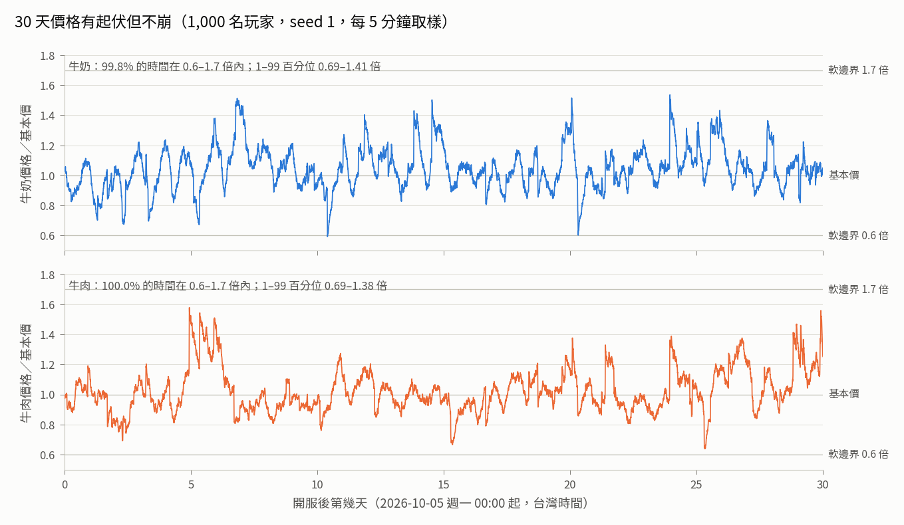

**圖 2　各人數的價格分布。** 細線是 1–99 百分位，粗段是 5–95 百分位，圓點是中位數；下方數字是價格落在 0.6–1.7 倍內的時間比例。

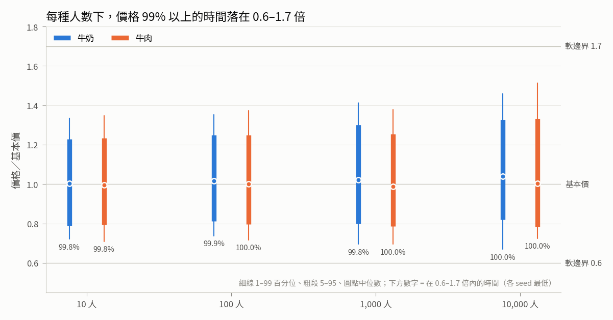

**圖 3　各策略週收入（10,000 人）。** 左圖是絕對值，右圖是和 S1 的比值。前兩週 S3 比較低（配種要時間），第 4 週 S4 最高。

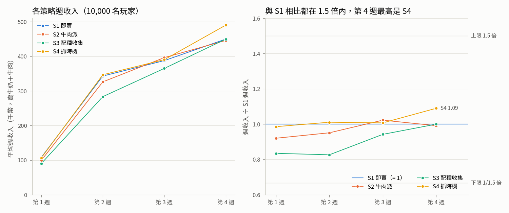

**圖 4　大戶倒貨對價格的影響。** 縱軸是「倒貨」比「一直囤著不賣」低多少。2 小時內最多 0.13%，遠低於 0.75% 的理論上限；之後的起伏是其他玩家的決定慢慢分岔造成的，有正有負。

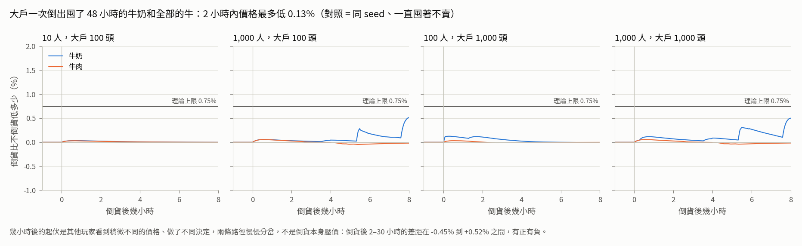

**圖 5　大戶自己的滑價：一次倒出 vs 分 8 批。** 橫軸第三行是倒出的量相當於全服幾小時的賣量。量大時一次倒出明顯吃虧；量很小時，差別不大。

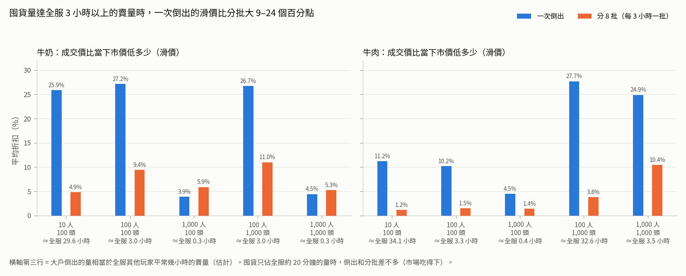

**圖 6　大利多後大家同時賣（1,000 人）。** 灰線是同一則新聞、沒有恐慌的對照組。牛肉因為大家一次出貨很多頭，多跌約一成；牛奶每人手上的存量少，只多跌 2%。

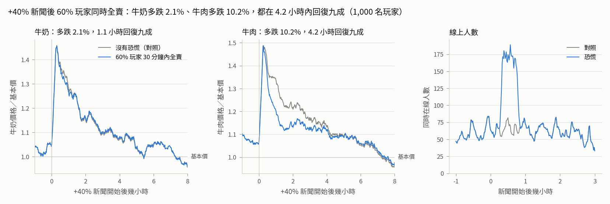

**圖 7　某天只有兩成的人上線（1,000 人）。** 灰底是那一天。需求跟著線上人數變少，價格和平常只差 1% 左右。

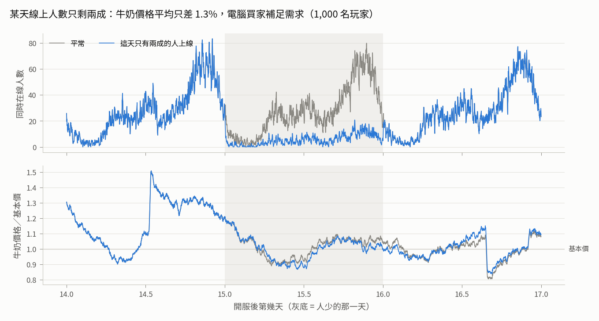

## 5. 詳細結果（v0.1）

表 A–H 由 [`economy/sim/tables.py`](economy/sim/tables.py) 從 `goals.json` 產生。

### 5.1 表 A：價格分布（價格 ÷ 基本價，每 1 分鐘取樣，30 天）

| 人數 | seed 數 | 商品 | 在 0.6–1.7 倍內（各 seed 最低） | 1% | 5% | 中位數 | 95% | 99% | 最低 | 最高 | 每日高低差中位數 | 平均賣壓 |
|---:|---:|---|---:|---:|---:|---:|---:|---:|---:|---:|---:|---:|
| 10 | 5 | 牛奶 | 99.80% | 0.72 | 0.79 | 1.00 | 1.23 | 1.33 | 0.57 | 1.68 | 46% | +0.0% |
| 10 | 5 | 牛肉 | 99.80% | 0.71 | 0.79 | 1.00 | 1.23 | 1.35 | 0.56 | 1.59 | 40% | +0.0% |
| 100 | 3 | 牛奶 | 99.93% | 0.74 | 0.81 | 1.02 | 1.25 | 1.35 | 0.57 | 1.69 | 46% | +0.1% |
| 100 | 3 | 牛肉 | 99.97% | 0.72 | 0.80 | 1.00 | 1.25 | 1.37 | 0.58 | 1.56 | 41% | -0.0% |
| 1,000 | 2 | 牛奶 | 99.81% | 0.69 | 0.80 | 1.02 | 1.30 | 1.41 | 0.55 | 1.84 | 58% | +0.1% |
| 1,000 | 2 | 牛肉 | 100.00% | 0.69 | 0.79 | 0.99 | 1.25 | 1.38 | 0.60 | 1.58 | 44% | -0.4% |
| 10,000 | 1 | 牛奶 | 99.97% | 0.67 | 0.82 | 1.04 | 1.33 | 1.46 | 0.59 | 1.56 | 55% | -0.0% |
| 10,000 | 1 | 牛肉 | 99.99% | 0.72 | 0.78 | 1.00 | 1.33 | 1.51 | 0.59 | 1.64 | 54% | -0.5% |

### 5.2 表 B：各策略平均週收入（千幣；牛奶＋牛肉賣出收入）

| 人數 | 週 | S1 即賣 | S2 牛肉派 | S3 配種收集 | S4 抓時機 | 最高÷最低 | 最高 | S4÷S1 |
|---:|---|---:|---:|---:|---:|---:|---|---:|
| 10 | 第 1 週 | 100 | 82 | 84 | 90 | 1.22 | S1 | 0.898 |
| 10 | 第 2 週 | 320 | 318 | 269 | 317 | 1.19 | S1 | 0.991 |
| 10 | 第 3 週 | 378 | 392 | 348 | 377 | 1.13 | S2 | 0.996 |
| 10 | 第 4 週 | 416 | 409 | 399 | 424 | 1.06 | S4 | 1.018 |
| 10 | **28 天合計** | 1215 | 1201 | 1099 | 1208 | 1.11 | S1 | 0.994 |
| 100 | 第 1 週 | 108 | 106 | 91 | 108 | 1.18 | S1 | 0.999 |
| 100 | 第 2 週 | 327 | 312 | 271 | 329 | 1.21 | S4 | 1.006 |
| 100 | 第 3 週 | 384 | 397 | 367 | 394 | 1.08 | S2 | 1.025 |
| 100 | 第 4 週 | 420 | 420 | 429 | 448 | 1.07 | S4 | 1.068 |
| 100 | **28 天合計** | 1239 | 1234 | 1158 | 1279 | 1.10 | S4 | 1.032 |
| 1,000 | 第 1 週 | 110 | 101 | 91 | 109 | 1.22 | S1 | 0.990 |
| 1,000 | 第 2 週 | 327 | 310 | 269 | 331 | 1.23 | S4 | 1.011 |
| 1,000 | 第 3 週 | 391 | 401 | 367 | 405 | 1.10 | S4 | 1.035 |
| 1,000 | 第 4 週 | 427 | 424 | 421 | 458 | 1.09 | S4 | 1.073 |
| 1,000 | **28 天合計** | 1256 | 1235 | 1148 | 1303 | 1.14 | S4 | 1.038 |
| 10,000 | 第 1 週 | 108 | 99 | 90 | 106 | 1.20 | S1 | 0.986 |
| 10,000 | 第 2 週 | 343 | 326 | 283 | 347 | 1.22 | S4 | 1.011 |
| 10,000 | 第 3 週 | 388 | 396 | 365 | 390 | 1.09 | S2 | 1.007 |
| 10,000 | 第 4 週 | 450 | 446 | 450 | 490 | 1.10 | S4 | 1.090 |
| 10,000 | **28 天合計** | 1288 | 1267 | 1188 | 1333 | 1.12 | S4 | 1.035 |

### 5.3 表 B2：第 30 天的牧場（10,000 人）

| 策略 | 28 天淨收入（扣小牛與配種費，千幣） | 第 30 天總資產（千幣） | 牛舍格數 | 牛群稀有度 一般／優良／稀有／傳說 |
|---|---:|---:|---:|---|
| S1 即賣 | 1163 | 222 | 22.6 | 94%／6%／0%／0% |
| S2 牛肉派 | 1118 | 220 | 22.6 | 93%／7%／0%／0% |
| S3 配種收集 | 1094 | 281 | 22.4 | 32%／21%／37%／10% |
| S4 抓時機 | 1211 | 225 | 22.6 | 93%／6%／0%／0% |

### 5.4 表 C：大戶拋售（理論上限：一次倒貨 0.75%，一個人不停地賣 6.3%）

| 情境 | 商品 | 倒出量 ≈ 全服幾小時的賣量 | 倒貨後 2 小時內價格最多低 | 一次倒出的滑價 | 分 8 批的滑價 | 倒出均價 ÷ 分批均價 |
|---|---|---:|---:|---:|---:|---:|
| 10 人＋大戶 100 頭 | 牛奶 | 29.6 | 0.03% | 25.9% | 4.9% | 0.75 |
| 10 人＋大戶 100 頭 | 牛肉 | 34.1 | 0.03% | 11.2% | 1.2% | 0.85 |
| 100 人＋大戶 100 頭 | 牛奶 | 3.0 | 0.13% | 27.2% | 9.4% | 0.76 |
| 100 人＋大戶 100 頭 | 牛肉 | 3.3 | 0.03% | 10.2% | 1.5% | 0.85 |
| 1,000 人＋大戶 100 頭 | 牛奶 | 0.3 | 0.06% | 3.9% | 5.9% | 1.05 |
| 1,000 人＋大戶 100 頭 | 牛肉 | 0.4 | 0.06% | 4.5% | 1.4% | 0.94 |
| 100 人＋大戶 1,000 頭 | 牛奶 | 3.0 | 0.13% | 26.7% | 11.0% | 0.77 |
| 100 人＋大戶 1,000 頭 | 牛肉 | 32.6 | 0.03% | 27.7% | 3.8% | 0.70 |
| 1,000 人＋大戶 1,000 頭 | 牛奶 | 0.3 | 0.12% | 4.5% | 5.3% | 1.01 |
| 1,000 人＋大戶 1,000 頭 | 牛肉 | 3.5 | 0.06% | 24.9% | 10.4% | 0.81 |

### 5.5 表 D：新手（12,350 位玩家，全部基本情境合計）

| 里程碑 | 目標 | 最快 | 中位數 | 90% | 最慢 | 達成人數 |
|---|---|---:|---:|---:|---:|---:|
| 第一次賣奶 | 5 分鐘內 | 0 分 | 0 分 | 0 分 | 0 分 | 12,350／12,350 |
| 第一次擴建 | 約 15 分鐘 | 15 分 | 15 分 | 15 分 | 15 分 | 12,350／12,350 |
| 第一次配種 | 30 分鐘內 | 20 分 | 20 分 | 20 分 | 20 分 | 12,350／12,350 |

### 5.6 表 E：大利多（+40%）後 60% 玩家 30 分鐘內全賣（對照 = 同 seed、同一則新聞、沒有恐慌）

| 人數 | 商品 | 新聞前 | 新聞高點（對照） | 3 小時內比對照多跌 | 發生在新聞後 | 回復九成（新聞後） | 同時在線高峰 恐慌／對照 |
|---:|---|---:|---:|---:|---:|---:|---:|
| 100 | 牛奶 | 1.00 | 1.42 | 4.9% | 0.8 小時 | 3.4 小時 | 18／12 |
| 100 | 牛肉 | 1.05 | 1.45 | 10.7% | 1.1 小時 | 4.8 小時 | 18／12 |
| 1,000 | 牛奶 | 1.03 | 1.46 | 2.1% | 0.8 小時 | 1.1 小時 | 189／83 |
| 1,000 | 牛肉 | 1.07 | 1.49 | 10.2% | 1.1 小時 | 4.2 小時 | 189／83 |

### 5.7 表 F：某天只有兩成的人上線（第 16 天，對照 = 同 seed 平常的那天）

| 人數 | 平均同時在線 平常→人少 | 牛奶均價 平常→人少 | 人少÷平常（平均） | 人少÷平常（最大） | 牛肉均價 平常→人少 |
|---:|---:|---:|---:|---:|---:|
| 100 | 2.8→0.6 | 1.009→1.021 | 1.012 | 1.035 | 0.888→0.892 |
| 1,000 | 27.6→5.4 | 1.021→1.007 | 0.987 | 1.040 | 0.877→0.850 |

### 5.8 表 G：tick 1 分鐘 vs 5 分鐘（1,000 人，同 seed）

| seed | 商品 | 中位數 1 分／5 分 | 對數標準差 1 分／5 分 | 平均賣壓 1 分／5 分 | 在 0.6–1.7 倍內 1 分／5 分 |
|---|---|---:|---:|---:|---:|
| s1 | 牛奶 | 1.037／1.004 | 0.136／0.133 | +0.0%／+0.1% | 99.97%／100.00% |
| s1 | 牛肉 | 0.999／1.002 | 0.138／0.135 | -0.4%／-0.4% | 100.00%／99.99% |
| s2 | 牛奶 | 1.007／1.021 | 0.154／0.176 | +0.1%／+0.1% | 99.81%／99.66% |
| s2 | 牛肉 | 0.975／0.983 | 0.139／0.157 | -0.3%／-0.3% | 100.00%／99.75% |

| seed | 28 天收入（千幣）1 分／5 分 | 耗時 1 分／5 分 |
|---|---|---:|
| s1 | S1 1278／1251、S2 1252／1239、S3 1170／1157、S4 1325／1294 | 29／28 秒 |
| s2 | S1 1234／1250、S2 1219／1216、S3 1126／1139、S4 1281／1297 | 30／28 秒 |

參考（隨機性本身有多大）：同樣 1 分鐘 tick、seed 1 與 seed 2 的中位數 牛奶 1.037／1.007、牛肉 0.999／0.975。

### 5.9 表 H：模擬耗時（牆鐘時間，單一行程）

| 情境 | 玩家 | tick | 秒 | 玩家動作次數 |
|---|---:|---:|---:|---:|
| base_10_s1 | 10 | 60 秒 | 2 | 2,092 |
| base_100_s1 | 100 | 60 秒 | 4 | 21,392 |
| base_1000_s1 | 1,000 | 60 秒 | 30 | 209,157 |
| base_1000_s1_tick300 | 1,000 | 300 秒 | 28 | 209,142 |
| base_10000_s1 | 10,000 | 60 秒 | 308 | 2,069,110 |

**怎麼讀表 C**：「倒出量 ≈ 全服幾小時的賣量」是估計值，用對照組第 3 週其他玩家的賣出收入 ÷ 基本價 ÷ 168 小時換算，誤差約 ±5%。1,000 人時大戶的牛奶只有全服約 20 分鐘的量（倉庫與奶桶最多存約 6 萬瓶），市場吃得下：一次倒出的滑價 3.9–4.5%，和分批差不多；分批裡夜間那幾批遇到的市場比較淺，所以分批反而略差。這種情況不算「拋售划算」，只是量太小，拋不拋都一樣。

**怎麼讀表 E**：牛肉多跌一成，是因為恐慌時大家把成年 48 小時以上的牛一次出貨，量遠大於平常。牛奶只多跌 2–5%：大家平常每次上線都賣，手上存量本來就少，而且需求會跟著線上人數放大（最多到平均的 3 倍）。如果希望「大家一起賣」跌得更多，可以把 λ↓ 從 0.12 調高；但一個玩家的影響上限也會等比例變大（上限 = 1 − exp(−λ↓ × 0.25 × 0.25)）。

**怎麼讀表 G**：同一個 seed，換成 5 分鐘 tick 後，隨機起伏的抽樣次數不同，路徑本來就不一樣。所以要比的是「差多少」和「不同 seed 之間本來就差多少」。兩者同一量級：中位數差 0.3–3.3%，seed 1 和 seed 2 之間差 2.4–3.0%。對數標準差差 −2% 到 +14%（seed 2 的 5 分鐘版本較大，seed 1 則較小）。賣壓平均值完全相同，收入差 −2.3% 到 +1.3%。單元測試另外驗證：市場本身換 tick 後平均與標準差一致、事件序列完全相同、持續超賣時的賣壓穩態與 tick 無關。

### 5.10 S4 抓時機的每單位優勢（`sim/unitprice.py`，1,000 人，seed 1，第 15–30 天）

| 策略 | 每瓶牛奶實收（幣） | 每公斤牛肉實收（幣） | 每人每天賣出牛奶（瓶） | 每人每天賣出牛肉（公斤） |
|---|---:|---:|---:|---:|
| S1 | 10.67 | 12.16 | 4,182 | 1,302 |
| S2 | 10.67 | 12.76 | 2,390 | 2,803 |
| S3 | 13.84 | 15.92 | 2,773 | 1,267 |
| S4 | 11.22 | 12.90 | 4,190 | 1,273 |

S4 ÷ S1：每瓶牛奶 1.052、每公斤牛肉 1.061、牛奶賣量 1.002、牛肉賣量 0.978。實收價含稀有度、新鮮度與滑價；S3 高是因為稀有牛的倍率。同期市場的時間平均價：牛奶 10.45、牛肉 12.28。

### 5.11 一般玩家付的滑價（`sim/slipcheck.py`，10 天，seed 7）

| 人數 | 商品 | 賣單數 | 以金額加權的平均折扣 | 中位數 | 90% | 99% |
|---:|---|---:|---:|---:|---:|---:|
| 100 | 牛奶 | 14,157 | 1.86% | 1.50% | 3.60% | 6.80% |
| 100 | 牛肉 | 969 | 0.86% | 0.45% | 0.92% | 2.19% |
| 1,000 | 牛奶 | 141,478 | 0.30% | 0.20% | 0.73% | 2.83% |
| 1,000 | 牛肉 | 9,634 | 0.63% | 0.33% | 0.78% | 1.61% |

賣單數包含教學期間每分鐘賣一次的小單。

### 5.12 目標 (b) 的調整紀錄

每一輪都是 200 人、30 天、seed 1–3（另註明者除外），比 30 天總收入。這些是中間版本的引擎（還沒有 3 倍上限、新手開放時間與長期賣壓吸收），所以數字和表 B 不同；最終數字以表 B 為準。當時用的是暫存腳本，已經隨重開機清掉，這張表無法照原樣重跑，只能當作調整方向的紀錄。

| 輪 | 改了什麼 | S4 ÷ S1 | 收入最高 | 最高 ÷ 最低 |
|---|---|---:|---|---:|
| 0 | 初版：日內 ±5%、肉用牛最佳體重 500 公斤、稀有倍率 1.25／1.6／2.5；S4 價格 ≥ 均價 × 1.03 才賣、8 頭開始存 | 0.96–0.97（seed 1、2） | S2 | 1.17–1.22 |
| 1 | S4 規則：價格 ≥ 均價就賣、產奶 75% 前等牛肉價、12 頭才開始存 | 0.99–1.02 | S2 | 約 1.15 |
| 2 | 肉用牛最佳體重 500 → 480 公斤 | 1.004（3 seed 平均） | S2 | 1.17 |
| 3 | 再把日內波動 ±5% → ±8%（牛肉 ±4% → ±7%） | 1.025 | S2 | 1.17 |
| 4 | 肉用牛 → 450 公斤 | 1.025 | S4（領先 S2 不到 0.3%） | 1.13 |
| 5 | 肉用牛 → 440 公斤；稀有倍率 → 1.3／1.7／2.5 | 1.025；1,000 人 1.036 | S4 | 1.10–1.13 |

第 5 輪採用。另外用中間版本跑過一次 200 人、63 天：S3 在第 5–9 週的週收入是 45.2 萬–47.5 萬，S1 是 47.1 萬–50.3 萬。9 週內 S3 沒有跑到其他策略前面，但稀有牛會一直累積，最終引擎還沒有重跑長期測試。

## 6. 速度與大小（伺服器角度；v0.1）

量法：`python3 -m sim.bench`。每項重複 200–2,000 次，取 5 輪的中位數與最慢值。環境：Surface（Linux 6.19，8 核心，7.7 GB 記憶體），Python 3.10.12，量測時機器同時在使用中。

| 項目 | 中位數 | 最慢 |
|---|---:|---:|
| 市場更新一次（牛奶＋牛肉、含新聞） | 20 微秒 | 24 微秒 |
| 玩家收奶並全部賣出（20 頭牛、奶桶 10 級） | 50 微秒 | 64 微秒 |
| 奶桶結算（20 頭牛） | 32 微秒 | 39 微秒 |

- 換算（估計）：10,000 位玩家每天約 6 萬次上線，每次 1 筆賣單，一天約 3 秒 CPU；市場每天 1,440 次更新，約 0.03 秒。對伺服器負擔可以忽略。
- 每位玩家要多存的市場狀態：兩種商品的 `ImpactState` 共 123 位元組（JSON）。市場狀態 `snapshot()` 共 747 位元組。
- 模擬本身（表 H）：10,000 人 30 天 308 秒；單一行程記憶體約 200 MB。

## 7. 對現有架構的影響（M1；v0.1）

- **伺服器直接 import `cowecon`**，不複製程式：`Exchange` 每 1 分鐘呼叫一次 `step(現在時間, 這一分鐘的同時在線人數)`；賣奶用 `Farm.sell_all_milk`／`sell_lots`，出貨用 `Farm.ship`／`ship_many`。模擬用的就是這些函式，所以模擬的數字就是遊戲的數字。
- **「同時在線人數」的定義要和模擬一致**：這一分鐘內有連線、在遊戲裡的玩家數（模擬用上線時段的重疊時間計算）。算法不同，需求就會偏掉。
- **時間只用伺服器時間**。奶桶、新鮮度、牛的年齡都是封閉式計算，玩家不用在線，改手機時間也沒有用。
- **M1 要補的功能**（引擎目前沒有）：
  - 從 `Market.snapshot()` 還原市場。
  - 保存亂數狀態（`random.Random.getstate()`），重啟後事件和隨機起伏才能接續。
  - `Farm` 與資料庫欄位互轉（目前只有 `ImpactState.to_dict／from_dict`）。
  - 重啟後的回復流程依 api-evolution 規則處理。
- **畫面需要的資料**：
  - 走勢圖與 24 小時均線：`Market.moving_average()`，正式版改由資料庫存歷史。
  - 即將發生的新聞：`Exchange.upcoming(now)`；看得到的新聞：`visible(now)`。
  - 賣出前預估：`Market.quote()`，不改變任何狀態。
  - 配種機率公開：`offspring_distribution`、`tier_distribution`。
- **驗收**：[`economy/sim/scenarios.py`](economy/sim/scenarios.py) 是純資料。M1 把基本、大戶、恐慌、人少、tick 比較這幾組情境改成伺服器自動測試，同 seed 應該重現 `goals.json` 的數字。伺服器啟動時印出 `DEFAULT.fingerprint()`，和 `c07566a5d81d7eec` 相同才代表參數沒被改動。
- **第二階段牧場股市（D1）**：`Market` 是一種商品一份，事件可以指定多個商品。虛構公司的股票可以直接用新的 `CommodityParams`（基本價、波動、賣壓），再把股利連到牛奶與牛肉價格。

## 8. 建議與分階段（v0.1）

1. **M1（伺服器原型）**：`backend/` import `cowecon`，補上第 7 節列的保存與還原功能。驗收：
   - 30 個單元測試全過。
   - 情境測試同 seed 重現 `goals.json` 的四個目標數字。
   - 10,000 位假玩家 30 天的市場更新不影響 API 反應時間。
2. **企劃書定稿前，請使用者決定三件事**：
   - 價格波動大小：目前每天高低差約 40–58%，主要來自新聞；想要更穩就把新聞幅度或頻率調低。
   - 新手節奏：第 15 分鐘開放擴建、開局 1 小時產奶 ×5、第一次配種免費。
   - 多帳號政策：訪客帳號可以無限開，會放大一個人的影響與滑價額度。
3. **M1 試玩後**：
   - 用真實上線時段取代假設的權重表，重跑一次。
   - 看玩家實際「存貨等好價」的比例，再調 S4 相關的數值（日內波動、新鮮度）。
4. **上架前**：
   - 用最終引擎跑 90 天，檢查 S3 稀有牛累積後的長期平衡。
   - 為第 2 個月之後補新的花錢項目：第 21 次擴建要 35 萬幣，擴建自然停在 22 格左右，之後錢會一直累積。

**不建議**：
- 照起始公式的「每 tick 上限、單筆滑價」上線：玩家拆單就不用付滑價，換 tick 大小結果也會變（見 2.8）。
- 把新聞放進 OU 的目標價：新聞只會顯現 20–43%，而且晚 5–10 小時才到頂。
- 寫死每位玩家的需求：牛群長 10 倍以上，價格會一路被壓到下限。


## 9. v0.2 規則（企劃書 4.0、決定 D17；2026-09-30 重跑，同日平衡調整為 v0.2.1）

使用者 2026-09-30 的玩法修改，完整規則見企劃書 `docs/design/gdd.md` 4.0：
- 乳牛、耕牛、肉牛三種用途，只有母乳牛產奶。
- 耕牛耕田種稻，稻米是第三種行情商品。
- 商店只挑 A／B／C 等級，內容隨機。
- 出貨時肉品評 A／B／C 級。
- 每頭牛一輩子配種一次；借種要付錢給公牛主人。

同一天 ceo 又加了兩條平衡目標：
- 牛奶佔全服收入 25–40%。
- 耕田派 ÷ 乳牛派要在 0.93–1.07，而且不能每種人數都第一。

所以只調 `params.py` 的數值、沒改 API，稱為 v0.2.1。本節的數字都是 v0.2.1。

- 引擎在 `backend/cowecon/`（版本 0.2.0，參數指紋 **`9097bb48b2949aa3`**）。
- 給伺服器的變更清單：[`economy/v0.2-engine-changes.md`](economy/v0.2-engine-changes.md)。
- v0.1 的圖與摘要在 [`economy/out/v0.1/`](economy/out/v0.1/)。逐分鐘的 CSV 可以用 git 版本 `3aeeacb` 重建，沒有保留。

### 9.0 先說結論（v0.2.1）

1. **目標全部達到**。10／100／1,000 人各跑 30 天；10,000 人跑 1 次，也是 30 天。
   - 三種商品的價格在基本價 0.6–1.7 倍內：最低 **99.59%**。
   - 六種玩法的週收入：每週最高 ÷ 最低最大 **1.38**（10 人第 1 週）；30 天合計 1.04–1.16。
   - **牛奶佔全服收入 30.4–31.1%**（目標 25–40%；調整前 11–16%）。
   - **耕田派 ÷ 乳牛派 = 0.994／1.031／1.019／1.028**（10／100／1,000／10,000 人；目標 0.93–1.07）。耕田派的名次是第 2／4／3／3，沒有一種人數是第一。
   - 大戶一次倒貨：2 小時內價格最多低 **0.08%**（上限 0.75%）。囤貨達全服 3 小時以上賣量時，一次倒出的滑價比分批大 8–23 個百分點。
   - 新手：12,350 人全部在 **第 0 分鐘第一次賣奶、第 20 分鐘第一次配種**（第 15 分鐘擴建）。
   - **借種**：每人每天約 0.6–0.8 筆成交。最高借種價 5,000 幣 ≈ 一頭壯年乳牛 **1.24 天**的奶錢（每天 4,032 幣）。出借公牛派的借種收入只佔它總收入的 **2.6–3.1%**。
   - **商店**：三級淨賺 A 9,091、B 8,764、C 8,666，**相差 4.9%**。份額 A 70–74%、B 13–15%、C 13–15%。
2. **平衡調整只改了 6 個數值**（9.2）：
   - 母乳牛每小時 11 → 14 瓶。
   - 牛奶基本價 10 → 12 幣。
   - 商店抽到乳牛的機率 1/3 → 45%（耕牛、肉牛各 27.5%）。
   - 起始奶桶 24 → 28 瓶，維持約 2 小時產量。
   - 耕牛每小時 15 → 11 公斤。
   - 第 2 塊田 1,500 → 1,800 幣。
3. **最重要的三個設計發現**
   1. **v0.2 規則會讓牛奶變配角**：只有母乳牛產奶，每頭牛最後又都出貨，調整前牛奶只佔 11–16%。要拉回來，同時要「每頭乳牛更值錢」（產量與價格）和「乳牛更多」（商店機率）。只調其中一種，要調到很極端才到 25%：只改產量和價格的一組，牛奶 26%、耕田派仍第一。
   2. **耕田派一面倒，是田地和稻米太划算**。第一版 1.31 倍；田 1,500 起、稻米 15 公斤是 1.10；再降到 11 公斤、田 1,800 起，才讓耕田派不再每次第一。
   3. **商店三級要用「淨賺相同」來定價**。每 1 幣換到的價值 C 最高（10.6 對 A 3.8），錢少的新手買 C 最划算；牛舍滿了以後三級差不多。
4. **還沒解決**（9.8）：
   - 借種成交有 44% 是電腦假玩家 300 幣的公牛，等於便宜的小牛來源。（2026-10-02 D26 之後見第 10 節。）
   - 牛肉仍佔 64%。
   - 只跑了 30 天。

### 9.1 目標與實際數字（v0.2.1）

量法：[`economy/sim/`](economy/sim/) 的六種玩家 bot 加大戶，在三個共用市場上跑，1 分鐘 tick。價格每分鐘取樣；收入從每位玩家的每日帳本加總（賣牛奶、牛肉、稻米的收入 + 借種收入）。詳細數字見 9.6；原始數據在 [`economy/out/goals.json`](economy/out/goals.json) 與 [`economy/out/runs/`](economy/out/runs/)。

| 目標 | 怎麼量 | 結果 | 達成 |
|---|---|---|---|
| 三種商品價格 ≥95% 的時間在 0.6–1.7 倍 | 各人數、各 seed 最低 | 99.59%–100% | 是 |
| 各玩法週收入差 ≤1.5 倍 | 六種玩法平均週收入，每週最高 ÷ 最低 | 最大 1.38；30 天合計 1.04–1.16 | 是 |
| 牛奶佔全服收入 25–40%（ceo 新增） | 28 天全部玩家的牛奶收入 ÷ 總收入（各策略人數加權） | 30.4%／30.6%／31.1%／30.6% | 是 |
| 耕田派 ÷ 乳牛派 0.93–1.07，而且 10／100／1,000 人至少一種不是第一（ceo 新增） | 30 天合計；各人數 seed 平均後排名 | 0.994／1.031／1.019／1.028；名次第 2／4／3（10,000 人第 3） | 是 |
| 大戶倒貨上限 | 同 seed「一直囤著」當對照組，倒貨後 2 小時內的差距 | 最多 0.08%（提出的上限 1%，理論上限 0.75%） | 是 |
| 新手：5 分鐘內賣東西、30 分鐘內配種 | 每位新玩家教學期間每分鐘動作一次 | 12,350 人全部 0 分鐘賣奶、20 分鐘配種 | 是 |
| 借種有成交、出借收入不失控 | 成交筆數；出借派的借種收入佔比；最高價 ÷ 壯年乳牛一天奶錢 | 每人每天 0.59–0.79 筆；2.6–3.1%；5,000 ÷ 4,032 = 1.24 天（D26 之後見第 10 節） | 是 |
| 商店三級都有人買、沒有明顯最划算的一級 | 1,000 人實測每頭牛一生價值 − 價格；購買份額；門檻：淨賺相差 ≤10%、每級份額 ≥10% | 淨賺相差 4.9%；份額 A 70–74%、B 13–15%、C 13–15% | 是 |

### 9.2 平衡調整（v0.2.1）：改了什麼、為什麼

200 人、28 天、seed 1 的試算，一次只跑一個，並用 `systemd-run` 限 1,500 MB：

| 組 | 改了什麼 | 牛奶佔 | 耕田÷乳牛 | 耕田名次 |
|---|---|---:|---:|---:|
| 調整前（v0.2） | — | 15.5% | 1.080 | 1 |
| 1 | 產奶 16 瓶、牛奶 13 幣 | 26.2% | 1.085 | 1 |
| 2 | 產奶 15 瓶、商店乳牛 50% | 28.8% | 1.075 | 1 |
| 3 | 產奶 14 瓶、牛奶 12 幣、商店乳牛 45% | 28.3% | 1.040 | 1 |
| 4 | 3 ＋ 稻米 13 公斤 | 28.6% | 1.053 | 1 |
| 5 | 3 ＋ 稻米 12 公斤、第 2 塊田 1,800 幣 | 28.6% | 1.000 | 3 |
| 採用 | 3 ＋ 稻米 11 公斤、第 2 塊田 1,800 幣 | 30.9%（1,000 人 seed 1 試算） | 1.018 | 4 |

- 第 5 組在 100 人時耕田派只比第一名少 0.3%，太接近，所以再降到 11 公斤。
- 調整後重新量了 bot 估價用的「每種牛一生價值」表（`sim/bots.py` 的 `VALUE_TABLE`）。量的時候稻米還是 12 公斤；改成 11 公斤後耕牛價值約低 5%，估值沒有再更新，影響很小。
- 商店價格沒有調：三級淨賺仍然相差不到 5%。

### 9.3 規則（白話；規則和 v0.2 相同，數值是 v0.2.1）

**三種牛**
- 基因不變（MM、MF、FF），名稱改成乳牛、耕牛、肉牛。
- 只有成年母乳牛產奶，每小時 14 瓶。
- 最佳體重：乳牛 250、耕牛 450、肉牛 800 公斤；公牛 ×1.1。
- 外觀規則 D18（肉牛＋C 光澤有短角）只影響長相，不影響任何經濟數值，引擎不需要改。

**耕田**
- 牧場開局 1 塊田，第 2 塊起 1,800 幣、每塊 ×1.6，最多 12 塊。
- 成年耕牛（公母都行）派到田裡，每小時產稻米 11 公斤 × 稀有度倍率 × 年齡曲線（和產奶同一條，老了會衰退）。
- 稻米長在田裡，最多存這頭牛壯年 8 小時的量，滿了就停；收成時進倉庫。
- 倉庫裡的稻米 72 小時內 100%，之後降到 240 小時剩 70%，不會壞掉。
- 在田裡的牛要先叫回來，才能出貨、配種、上架借種。
- **和企劃書的差異**：企劃書寫「耕地 → 種稻 → 一段時間後收成」，引擎用的是「持續長、最多存 8 小時、收成就清空」。這和奶桶的算法相同：可以用公式算、離線多久都準，也和乳牛公平。畫面可以把「田裡的量 ÷ 上限」畫成稻子的生長階段。要改成分段週期，只要改一個函式（`Farm._advance_fields`）。

**稻米行情**
- 第三個全服市場，基本價 5 幣／公斤。日內 ±6%、上午 11 點最高；週末 ±4%。
- 其他機制（需求、賣壓、每位玩家上限、滑價、邊界）和牛奶、牛肉相同。
- 新聞每天 4 則：只有牛奶 30%、只有牛肉 25%、只有稻米 25%、三種一起 20%。每種商品每天約 1.8–2 則，和 v0.1 差不多。

**商店 A／B／C**
- 只挑等級；用途（乳牛 45%、耕牛與肉牛各 27.5%）、公母（各半）都隨機。
- 每個稀有基因座的等位基因是隱性的機率：A 50%、B 30%、C 10%。
- 抽到稀有度 0／1／2／3 的機率：
  - A：42.2／42.2／14.1／1.6%。
  - B：75.4／22.4／2.2／0.1%。
  - C：97.0／2.9／0.03／0%。
- 引擎用 `shop_grade_distribution()` 算精確機率，給商店按鈕公開。
- 價格 A 3,200、B 1,700、C 900。

**出貨評級 A／B／C**
- 評級只看分數 s：
  - s = 0.7 × 狀態 + 0.3 × 稀有度 ÷ 3。
  - 狀態 = 體重 ÷ 最佳體重 × 年齡因素：最佳體重後 24 小時內是 1，之後慢慢降。
- 機率：P(A) = 0.10 + 0.50 × s；P(C) = 0.40 × (1 − s)；其餘是 B。
- 賣價倍率 A 1.25、B 1.0、C 0.75，再乘稀有度倍率。
- 引擎用 `beef_grade_probs()` 算精確機率，給出貨確認畫面公開。
- 實測分布：A 47–48%、B 42–43%、C 10%。

**配種一次、借種**
- 每頭牛一輩子配一次，公母一樣；自己的公母免費；沒有冷卻。
- 借種：
  - 主人把成年、沒配過、沒在田裡的公牛上架，從 300／800／2,000／5,000 幣挑一檔。
  - 借的人付錢給主人，小牛歸借的人，公牛和母牛的「一次」都用掉。
  - 電腦假玩家至少維持 3 筆 300 幣的一般公牛，這筆錢不給任何人（回收遊戲幣）。
- 實測的小牛來源（1,000 人，完整走完一生的牛）：商店 51%（A 36%、B 7%、C 8%）、自己配種 33%、借種 16%。

**bot**
- 六種玩法共用一套經營流程，差在偏好：
  - 乳牛派：母乳牛留到產奶掉到八成。
  - 肉牛派：全部 72 小時出貨。
  - 耕田派：會擴建田地。
  - 配種收集派：看重稀有度。
  - 抓時機派：三種商品都等好價錢。
  - 出借公牛派：公牛都上架；一天沒人借就降一檔。
- 大戶在囤貨前照乳牛派經營。
- 商店選等級用隨機效用模型：每一級的效用 = 這位玩家估的淨賺 + 個人差異（尺度 1,000 幣）。
- 借種：只有在值得（小牛期望價值 − 價格 > 0）才借。

### 9.4 參數表（v0.2.1；以 `backend/cowecon/params.py` 為準）

沒列在這裡的（行情機制、倉庫、冷藏、牛舍、新手）和第 3 節的 v0.1 相同。粗體是 v0.2.1 平衡調整改的。

| 項目 | v0.1 | v0.2.1 |
|---|---|---|
| 行情商品 | 牛奶 10 幣／瓶、牛肉 12 幣／公斤 | 牛奶 **12** 幣／瓶、牛肉 12 幣／公斤、稻米 5 幣／公斤 |
| 新聞 | 每天 3 則 | 每天 4 則；對象見 9.3 |
| 產奶（每小時） | 乳用 11、兼用 9、肉用 6（母牛） | 只有母乳牛 **14** |
| 起始奶桶 | 24 瓶 | **28** 瓶（約 2 小時產量） |
| 最佳體重（72 小時） | 250／350／440 公斤，公牛 ×1.2 | 250／450／800 公斤，公牛 ×1.1 |
| 耕田 | 無 | 耕牛每小時 **11** 公斤 × 稀有度倍率；開局 1 塊田，第 2 塊 **1,800** 幣、每塊 ×1.6、最多 12 塊；每塊最多存 8 小時的量 |
| 倉庫稻米 | 無 | 72 小時內 100%，240 小時降到 70% 後維持 |
| 商店 | 1,000 幣，選用途與公母 | A 3,200／B 1,700／C 900，全部隨機；乳牛 **45%**、耕牛 27.5%、肉牛 27.5%；隱性機率 50／30／10% |
| 出貨 | 肉質 × 稀有度 | 評級 A 1.25／B 1.0／C 0.75 × 稀有度；機率見 9.3 |
| 配種 | 300 ×（1＋最高稀有度）幣，母牛冷卻 24、公牛 2 小時 | 自己的免費，每頭一輩子一次 |
| 借種 | 無 | 300／800／2,000／5,000 幣四檔；電腦假玩家至少 3 筆 300 幣（2026-10-02 起依體重算，見第 10 節） |

### 9.5 圖表

配色照 dataviz 參考色盤：六種玩法依固定順序用 6 個類別色（`validate_palette.js` 相鄰檢查通過）；商店等級用單一藍色的有序色階（`--ordinal` 通過）。

**圖 9-1　30 天三種商品的價格（1,000 人，seed 1）。**

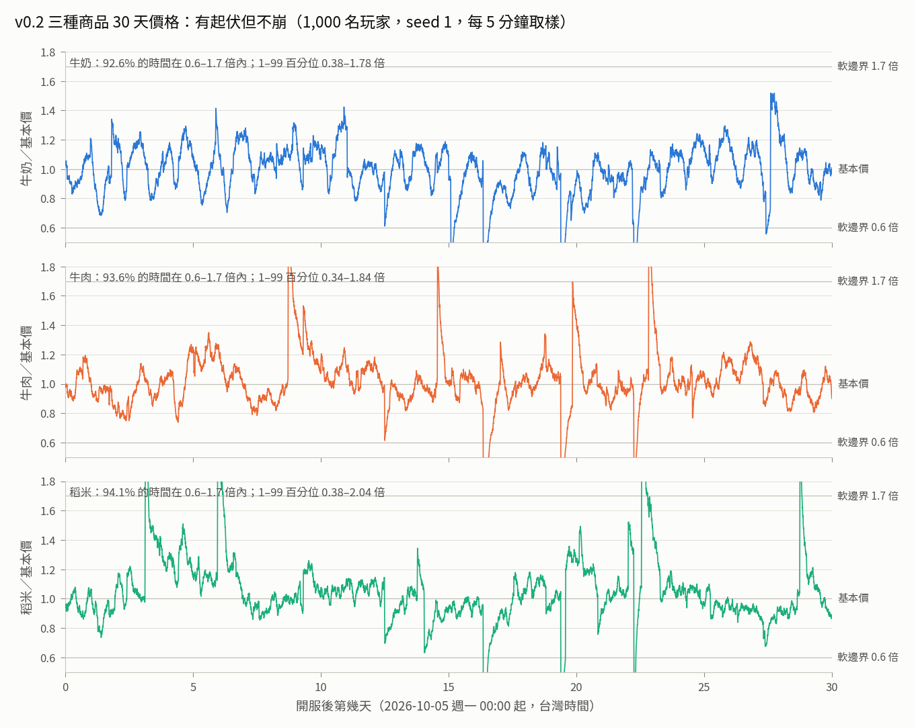

**圖 9-2　各人數的價格分布。** 細線 1–99 百分位、粗段 5–95、圓點中位數；下方數字是在 0.6–1.7 倍內的時間。

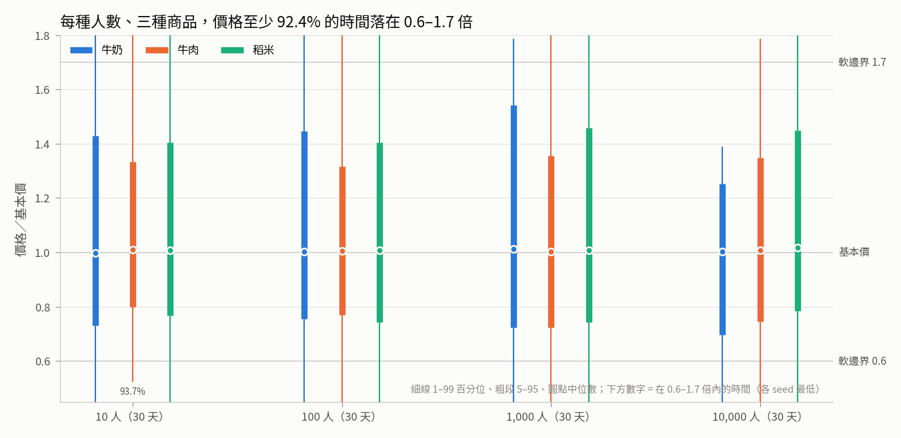

**圖 9-3　六種玩法的週收入（10,000 人）與比值。**

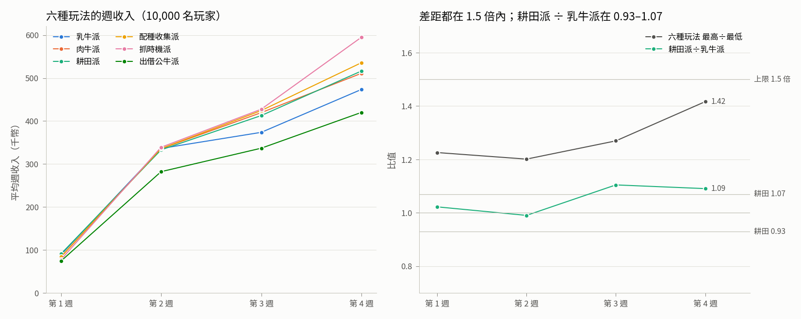

**圖 9-4　商店三級的淨賺與各玩法的購買份額。**

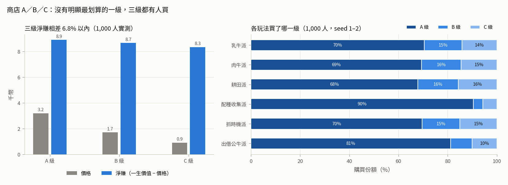

**圖 9-5　大戶倒貨對價格的影響。**

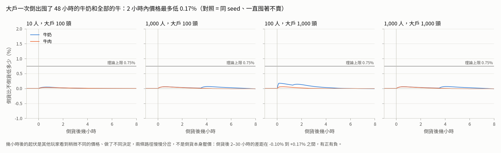

**圖 9-6　大戶自己的滑價：一次倒出 vs 分 8 批。**

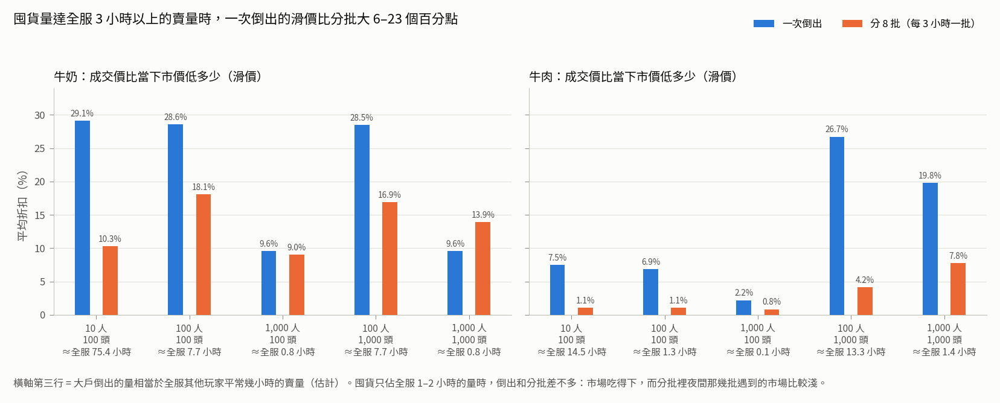

**圖 9-7　三種商品 +40% 後大家同時賣（1,000 人）。**

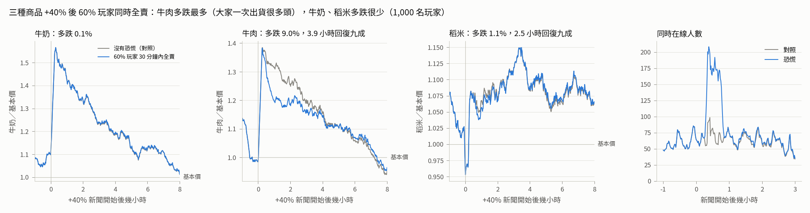

**圖 9-8　某天只有兩成的人上線（1,000 人）。**

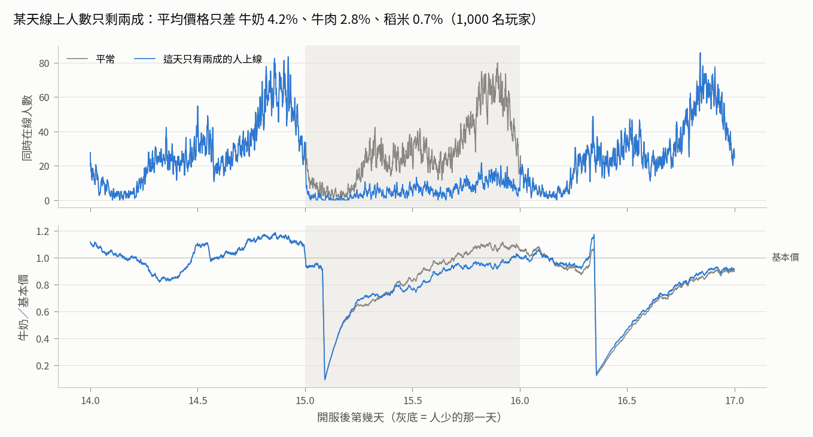

### 9.6 詳細結果（v0.2.1）

表由 [`economy/sim/tables.py`](economy/sim/tables.py) 從 `goals.json` 產生。

#### 9.6.1 表 A：價格分布（價格 ÷ 基本價，每 1 分鐘取樣）

| 人數 | 天數 | seed 數 | 商品 | 在 0.6–1.7 倍內（各 seed 最低） | 1% | 5% | 中位數 | 95% | 99% | 最低 | 最高 | 每日高低差中位數 | 平均賣壓 |
|---:|---:|---:|---|---:|---:|---:|---:|---:|---:|---:|---:|---:|---:|
| 10 | 30 | 5 | 牛奶 | 99.59% | 0.71 | 0.80 | 1.00 | 1.23 | 1.39 | 0.58 | 1.78 | 44% | +0.0% |
| 10 | 30 | 5 | 牛肉 | 99.74% | 0.72 | 0.82 | 1.00 | 1.21 | 1.32 | 0.56 | 1.65 | 37% | +0.0% |
| 10 | 30 | 5 | 稻米 | 100.00% | 0.74 | 0.81 | 1.00 | 1.24 | 1.39 | 0.61 | 1.65 | 38% | +0.0% |
| 100 | 30 | 3 | 牛奶 | 100.00% | 0.75 | 0.83 | 1.01 | 1.23 | 1.37 | 0.61 | 1.69 | 42% | +0.1% |
| 100 | 30 | 3 | 牛肉 | 99.74% | 0.74 | 0.84 | 1.01 | 1.22 | 1.33 | 0.56 | 1.51 | 37% | -0.1% |
| 100 | 30 | 3 | 稻米 | 100.00% | 0.76 | 0.83 | 1.00 | 1.26 | 1.39 | 0.60 | 1.65 | 36% | +0.0% |
| 1,000 | 30 | 2 | 牛奶 | 99.97% | 0.72 | 0.79 | 1.02 | 1.29 | 1.43 | 0.62 | 1.77 | 52% | +0.1% |
| 1,000 | 30 | 2 | 牛肉 | 99.77% | 0.72 | 0.82 | 1.01 | 1.21 | 1.29 | 0.57 | 1.46 | 37% | -0.3% |
| 1,000 | 30 | 2 | 稻米 | 99.90% | 0.72 | 0.82 | 1.00 | 1.27 | 1.42 | 0.57 | 1.63 | 37% | +0.2% |
| 10,000 | 30 | 1 | 牛奶 | 99.96% | 0.71 | 0.78 | 1.01 | 1.26 | 1.37 | 0.66 | 1.79 | 59% | +0.0% |
| 10,000 | 30 | 1 | 牛肉 | 100.00% | 0.74 | 0.82 | 1.01 | 1.26 | 1.36 | 0.66 | 1.46 | 39% | -0.3% |
| 10,000 | 30 | 1 | 稻米 | 99.91% | 0.73 | 0.82 | 1.01 | 1.33 | 1.49 | 0.56 | 1.68 | 42% | +0.3% |

#### 9.6.2 表 B：各策略平均週收入（千幣；賣牛奶、牛肉、稻米 + 借種收入）

| 人數 | 週 | 乳牛派 | 肉牛派 | 耕田派 | 配種收集派 | 抓時機派 | 出借公牛派 | 最高÷最低 | 最高 | 最低 | 耕田÷乳牛 |
|---:|---|---:|---:|---:|---:|---:|---:|---:|---|---|---:|
| 10 | 第 1 週 | 116 | 91 | 111 | 90 | 92 | 84 | 1.38 | 乳牛派 | 出借公牛派 | 0.96 |
| 10 | 第 2 週 | 361 | 357 | 355 | 363 | 343 | 296 | 1.23 | 配種收集派 | 出借公牛派 | 0.98 |
| 10 | 第 3 週 | 489 | 441 | 467 | 465 | 448 | 442 | 1.11 | 乳牛派 | 肉牛派 | 0.95 |
| 10 | 第 4 週 | 486 | 481 | 509 | 500 | 545 | 433 | 1.26 | 抓時機派 | 出借公牛派 | 1.05 |
| 10 | **合計** | 1451 | 1370 | 1442 | 1418 | 1428 | 1256 | 1.16 | 乳牛派 | 出借公牛派 | 0.99 |
| 100 | 第 1 週 | 104 | 120 | 115 | 107 | 102 | 121 | 1.19 | 出借公牛派 | 抓時機派 | 1.11 |
| 100 | 第 2 週 | 350 | 360 | 360 | 361 | 329 | 366 | 1.12 | 出借公牛派 | 抓時機派 | 1.03 |
| 100 | 第 3 週 | 456 | 466 | 477 | 485 | 451 | 477 | 1.08 | 配種收集派 | 抓時機派 | 1.05 |
| 100 | 第 4 週 | 497 | 510 | 499 | 538 | 519 | 522 | 1.08 | 配種收集派 | 乳牛派 | 1.00 |
| 100 | **合計** | 1407 | 1456 | 1451 | 1491 | 1400 | 1487 | 1.07 | 配種收集派 | 抓時機派 | 1.03 |
| 1,000 | 第 1 週 | 111 | 117 | 110 | 107 | 104 | 122 | 1.17 | 出借公牛派 | 抓時機派 | 0.99 |
| 1,000 | 第 2 週 | 351 | 356 | 352 | 357 | 349 | 372 | 1.07 | 出借公牛派 | 抓時機派 | 1.00 |
| 1,000 | 第 3 週 | 462 | 466 | 475 | 480 | 441 | 479 | 1.09 | 配種收集派 | 抓時機派 | 1.03 |
| 1,000 | 第 4 週 | 495 | 493 | 509 | 523 | 546 | 514 | 1.11 | 抓時機派 | 肉牛派 | 1.03 |
| 1,000 | **合計** | 1419 | 1431 | 1446 | 1467 | 1441 | 1487 | 1.05 | 出借公牛派 | 乳牛派 | 1.02 |
| 10,000 | 第 1 週 | 113 | 117 | 117 | 109 | 98 | 124 | 1.26 | 出借公牛派 | 抓時機派 | 1.04 |
| 10,000 | 第 2 週 | 358 | 363 | 366 | 372 | 364 | 377 | 1.05 | 出借公牛派 | 乳牛派 | 1.02 |
| 10,000 | 第 3 週 | 458 | 460 | 475 | 482 | 450 | 475 | 1.07 | 配種收集派 | 抓時機派 | 1.04 |
| 10,000 | 第 4 週 | 517 | 510 | 528 | 539 | 555 | 528 | 1.09 | 抓時機派 | 肉牛派 | 1.02 |
| 10,000 | **合計** | 1446 | 1452 | 1486 | 1502 | 1468 | 1503 | 1.04 | 出借公牛派 | 乳牛派 | 1.03 |

#### 9.6.3 表 B1：全服收入組成與耕田派排名（28 天，各策略人數加權）

| 人數 | 牛奶 | 牛肉 | 稻米 | 借種 | 30 天合計排名（高→低） | 耕田派名次 | 耕田÷乳牛 |
|---:|---:|---:|---:|---:|---|---:|---:|
| 10 | 30.4% | 64.2% | 5.1% | 0.2% | 乳牛派＞耕田派＞抓時機派＞配種收集派＞肉牛派＞出借公牛派 | 第 2 | 0.994 |
| 100 | 30.6% | 64.4% | 4.5% | 0.5% | 配種收集派＞出借公牛派＞肉牛派＞耕田派＞乳牛派＞抓時機派 | 第 4 | 1.031 |
| 1,000 | 31.1% | 63.9% | 4.4% | 0.5% | 出借公牛派＞配種收集派＞耕田派＞抓時機派＞肉牛派＞乳牛派 | 第 3 | 1.019 |
| 10,000 | 30.6% | 64.4% | 4.5% | 0.5% | 出借公牛派＞配種收集派＞耕田派＞抓時機派＞肉牛派＞乳牛派 | 第 3 | 1.028 |

#### 9.6.4 表 B2：收入來源與第 30 天的牧場（1,000 人，第 4 週）

| 策略 | 牛奶 | 牛肉 | 稻米 | 借種收入 | 合計淨收入（扣商店與借種費，千幣） | 第 30 天總資產（千幣） | 牛舍格數 | 田地 | 牛群 乳／耕／肉 | 稀有度 一般／優良／稀有／傳說 |
|---|---:|---:|---:|---:|---:|---:|---:|---:|---|---|
| 乳牛派 | 31% | 67% | 2% | 0% | 1226 | 242 | 22.8 | 1.0 | 45%／30%／25% | 50%／37%／12%／1% |
| 肉牛派 | 27% | 71% | 2% | 0% | 1229 | 236 | 22.8 | 1.0 | 41%／31%／28% | 52%／36%／11%／1% |
| 耕田派 | 26% | 62% | 12% | 0% | 1268 | 243 | 22.2 | 10.5 | 40%／38%／22% | 52%／37%／10%／1% |
| 配種收集派 | 33% | 64% | 2% | 0% | 1249 | 263 | 22.9 | 1.0 | 48%／29%／23% | 33%／47%／18%／2% |
| 抓時機派 | 29% | 69% | 2% | 0% | 1247 | 263 | 22.8 | 1.0 | 46%／29%／25% | 51%／36%／11%／1% |
| 出借公牛派 | 28% | 67% | 2% | 3% | 1242 | 240 | 22.9 | 1.0 | 45%／29%／26% | 55%／34%／10%／1% |

#### 9.6.5 表 C：大戶拋售（理論上限：一次倒貨 0.75%，一個人不停地賣 6.3%）

| 情境 | 商品 | 倒出量 ≈ 全服幾小時的賣量 | 倒貨後 2 小時內價格最多低 | 一次倒出的滑價 | 分 8 批的滑價 | 倒出均價 ÷ 分批均價 |
|---|---|---:|---:|---:|---:|---:|
| 10 人＋大戶 100 頭 | 牛奶 | 63.4 | 0.04% | 28.2% | 8.5% | 0.79 |
| 10 人＋大戶 100 頭 | 牛肉 | 13.5 | 0.04% | 9.2% | 1.2% | 0.85 |
| 100 人＋大戶 100 頭 | 牛奶 | 6.7 | 0.08% | 28.0% | 13.6% | 0.84 |
| 100 人＋大戶 100 頭 | 牛肉 | 1.4 | 0.04% | 8.1% | 1.2% | 0.86 |
| 1,000 人＋大戶 100 頭 | 牛奶 | 0.6 | 0.06% | 9.2% | 8.5% | 1.04 |
| 1,000 人＋大戶 100 頭 | 牛肉 | 0.1 | 0.06% | 2.4% | 1.0% | 0.94 |
| 100 人＋大戶 1,000 頭 | 牛奶 | 6.7 | 0.08% | 27.9% | 13.7% | 0.87 |
| 100 人＋大戶 1,000 頭 | 牛肉 | 13.8 | 0.04% | 27.2% | 4.6% | 0.70 |
| 1,000 人＋大戶 1,000 頭 | 牛奶 | 0.6 | 0.06% | 9.1% | 13.5% | 1.12 |
| 1,000 人＋大戶 1,000 頭 | 牛肉 | 1.4 | 0.06% | 20.6% | 9.2% | 0.83 |

#### 9.6.6 表 D：新手（12,350 位玩家，全部基本情境合計）

| 里程碑 | 目標 | 最快 | 中位數 | 90% | 最慢 | 達成人數 |
|---|---|---:|---:|---:|---:|---:|
| 第一次賣東西 | 5 分鐘內 | 0 分 | 0 分 | 0 分 | 0 分 | 12,350／12,350 |
| 第一次擴建 | 約 15 分鐘 | 15 分 | 15 分 | 15 分 | 15 分 | 12,350／12,350 |
| 第一次配種 | 30 分鐘內 | 20 分 | 20 分 | 20 分 | 20 分 | 12,350／12,350 |

#### 9.6.7 表 E：借種市場（最高借種價 5,000 幣 ≈ 一頭壯年乳牛 1.24 天的奶錢，4,032 幣／天，基本價）

| 人數 | 每天成交 | 每人每天 | 玩家上架的比例 | 300 | 800 | 2,000 | 5,000 | 電腦假玩家 300 | 出借派借種收入（幣／週） | 佔出借派收入 | 單一出借派 30 天最多 |
|---:|---:|---:|---:|---:|---:|---:|---:|---:|---:|---:|---:|
| 10 | 5.9 | 0.59 | 36% | 41 | 18 | 4 | 0 | 113 | 8,237 | 2.6% | 43,800 |
| 100 | 77.7 | 0.78 | 54% | 778 | 367 | 113 | 10 | 1063 | 11,737 | 3.1% | 64,900 |
| 1,000 | 787.8 | 0.79 | 56% | 8001 | 3978 | 1062 | 116 | 10475 | 11,653 | 3.1% | 75,200 |
| 10,000 | 7916.5 | 0.79 | 56% | 80750 | 39980 | 11013 | 1091 | 104662 | 11,721 | 3.0% | 80,100 |

（300／800／2,000／5,000 欄 = 各價位的成交筆數，多個 seed 平均。）

#### 9.6.8 表 F：商店 A／B／C

| 等級 | 價格 | 稀有度 一般／優良／稀有／傳說 | 1,000 人實測一生價值 | 淨賺（價值 − 價格） | 每 1 幣換到的價值 |
|---|---:|---|---:|---:|---:|
| A | 3,200 | 42.2%／42.2%／14.1%／1.6% | 12,291（33,719 頭） | 9,091 | 3.8 |
| B | 1,700 | 75.4%／22.4%／2.2%／0.1% | 10,464（6,771 頭） | 8,764 | 6.2 |
| C | 900 | 97.0%／2.9%／0.0%／0.0% | 9,566（7,647 頭） | 8,666 | 10.6 |

| 人數 | A 份額 | B 份額 | C 份額 |
|---:|---:|---:|---:|
| 10 | 70% | 15% | 15% |
| 100 | 74% | 13% | 13% |
| 1,000 | 73% | 13% | 13% |
| 10,000 | 74% | 13% | 13% |

#### 9.6.9 表 G：出貨評級實際分布

| 人數 | A | B | C |
|---:|---:|---:|---:|
| 10 | 48% | 42% | 10% |
| 100 | 47% | 43% | 10% |
| 1,000 | 48% | 43% | 10% |
| 10,000 | 48% | 43% | 10% |

#### 9.6.10 表 H：大利多（三種商品 +40%）後 60% 玩家 30 分鐘內全賣（對照 = 同 seed、同一則新聞、沒有恐慌）

| 人數 | 商品 | 新聞前 | 新聞高點（對照） | 3 小時內比對照多跌 | 回復九成（新聞後） | 同時在線高峰 恐慌／對照 |
|---:|---|---:|---:|---:|---:|---:|
| 100 | 牛奶 | 1.05 | 1.50 | 0.5% | 1.6 小時 | 18／12 |
| 100 | 牛肉 | 0.94 | 1.23 | 10.2% | 3.9 小時 | 18／12 |
| 100 | 稻米 | 0.99 | 1.28 | 2.3% | 3.6 小時 | 18／12 |
| 1,000 | 牛奶 | 1.05 | 1.55 | 0.3% | 1.4 小時 | 189／83 |
| 1,000 | 牛肉 | 0.92 | 1.22 | 9.2% | 3.9 小時 | 189／83 |
| 1,000 | 稻米 | 1.02 | 1.33 | 1.7% | 2.7 小時 | 189／83 |

#### 9.6.11 表 I：某天只有兩成的人上線（第 16 天，對照 = 同 seed 平常的那天）

| 人數 | 平均同時在線 平常→人少 | 牛奶 人少÷平常 | 牛肉 人少÷平常 | 稻米 人少÷平常 |
|---:|---:|---:|---:|---:|
| 100 | 2.8→0.6 | 1.010（1.00–1.02） | 1.005（1.00–1.01） | 1.010（1.00–1.03） |
| 1,000 | 27.6→5.4 | 0.965（0.86–1.09） | 0.965（0.82–1.08） | 0.994（0.91–1.12） |

#### 9.6.12 表 J：tick 1 分鐘 vs 5 分鐘（1,000 人，同 seed）

| seed | 商品 | 中位數 1 分／5 分 | 對數標準差 1 分／5 分 | 平均賣壓 1 分／5 分 |
|---|---|---:|---:|---:|
| s1 | 牛奶 | 1.015／0.998 | 0.139／0.136 | +0.1%／+0.1% |
| s1 | 牛肉 | 1.011／1.004 | 0.110／0.105 | -0.3%／-0.3% |
| s1 | 稻米 | 1.013／1.007 | 0.139／0.133 | +0.2%／+0.2% |
| s2 | 牛奶 | 1.026／1.034 | 0.155／0.160 | +0.1%／+0.1% |
| s2 | 牛肉 | 1.002／0.995 | 0.127／0.130 | -0.3%／-0.3% |
| s2 | 稻米 | 0.987／0.984 | 0.123／0.123 | +0.2%／+0.2% |

- s1 28 天收入（千幣，1 分／5 分）：乳牛派 1431／1410、肉牛派 1438／1427、耕田派 1457／1437、配種收集派 1474／1463、抓時機派 1459／1458、出借公牛派 1491／1470
- s2 28 天收入（千幣，1 分／5 分）：乳牛派 1407／1399、肉牛派 1425／1413、耕田派 1435／1410、配種收集派 1461／1456、抓時機派 1422／1425、出借公牛派 1483／1461
- 參考：同樣 1 分鐘 tick，seed 1 與 seed 2 的中位數 牛奶 1.015／1.026、牛肉 1.011／1.002、稻米 1.013／0.987。

#### 9.6.13 表 K：模擬耗時（牆鐘時間，單一行程，一次只跑一個）

| 情境 | 玩家 | 天數 | tick | 秒 | 玩家動作次數 |
|---|---:|---:|---:|---:|---:|
| base_10_s1 | 10 | 30 | 60 秒 | 3 | 2,090 |
| base_100_s1 | 100 | 30 | 60 秒 | 8 | 21,391 |
| base_1000_s1 | 1,000 | 30 | 60 秒 | 51 | 209,129 |
| base_1000_s1_tick300 | 1,000 | 30 | 300 秒 | 48 | 209,111 |
| base_10000_s1 | 10,000 | 30 | 60 秒 | 492 | 2,068,829 |

**其他量測（v0.2.1）**
- 抓時機派每單位比乳牛派多賣（`sim/unitprice.py`，1,000 人 seed 1，第 15–30 天）：牛奶 +6.2%、牛肉 +5.1%、稻米 +4.6%，賣出量差不多（0.96–1.00 倍）。
- 一般玩家付的滑價（`sim/slipcheck.py`，10 天、seed 7，以金額加權）：
  - 100 人：牛奶 1.7%、稻米 0.9%、牛肉 0.9%。
  - 1,000 人：牛奶 0.34%、稻米 0.39%、牛肉 0.56%。
- 伺服器角度的耗時（`sim/bench.py`）：
  - 三個市場更新一次 31–59 微秒（兩次量測，看機器負載）。
  - 20 頭乳牛的牧場收奶並賣出 60–69 微秒。
  - 一座 20 頭牛的牧場存檔 JSON 4.3 KB。

### 9.7 v0.2 第一版的調整紀錄（v0.2.1 之前）

| 輪 | 改了什麼 | 結果 |
|---|---|---|
| 0 | 初值：耕牛每小時 22 公斤、第 2 塊田 800 幣、每塊 ×1.5；商店選級規則是「買得起就買最高、淨賺差 10% 內」 | 1,000 人：耕田 ÷ 乳牛 1.31；B 級份額 1.5% |
| 1 | 商店改成隨機效用；估值改用實測表 | 200 人：份額 A 72%、B 14%、C 15% |
| 2 | 耕牛 16 公斤、田 1,500 幣起、每塊 ×1.6 | 200 人：耕田 ÷ 乳牛 1.106 |
| 3 | 耕牛 14 公斤、田 1,200 幣起 | 200 人：1.074 |
| v0.2 | 耕牛 15 公斤、田 1,500 幣起 | 正式跑：耕田 ÷ 乳牛 1.06–1.12，牛奶佔 11–16%（之後被 v0.2.1 取代） |

### 9.8 對伺服器的影響、限制、重現

**對伺服器的影響**
- 見 [`economy/v0.2-engine-changes.md`](economy/v0.2-engine-changes.md)。v0.2.1 只改數值，API 沒有變。
- 伺服器代理已經照清單修改 `backend/server/`、`backend/tests/`（工作區，還沒 commit）。2026-09-30 20:4x 用 v0.2.1 參數實測：伺服器測試 **52 個通過、1 個跳過**。
- `backend/README.md` 寫的參數指紋還是 v0.1 的 `c07566a5d81d7eec`，要改成 `9097bb48b2949aa3`（由伺服器代理或 ceo 改）。

**限制（v0.2.1）**
- **牛肉仍佔 64%**：每頭牛最後都會出貨，這是 v0.2 規則的結果。
- **商店份額**取決於 bot 的偏好模型，真實玩家會不同；模型可以保證的只有「三級淨賺差不多」。
- **借種**：電腦假玩家 300 幣的公牛佔成交 44%，讓每頭母牛都能用 300 幣換一頭小牛，比商店 C 級 900 幣便宜。價格要不要調高，請企劃決定。（2026-10-02：D26 之後公營種牛站照體重公式收 300／540／970 幣，見第 10 節。）
- **田地模型**和企劃書的分段週期不同（9.3）。
- **大戶情境**只測牛奶和牛肉；稻米用同一套機制與參數，上限相同，但沒有另外跑。
- **樣本數**：10,000 人只跑 1 個 seed、30 天；大戶最多測到 1,000 人。
- **長期**：只跑 30 天。配種收集派第 30 天的牛群有 18% 稀有、2% 傳說，更長期的平衡沒有驗證。
- **可重現性**：試算紀錄（9.2、9.7）用的是暫存腳本，沒有保留。可以用 `sim.run --only` 加覆寫參數重現相同的設定。

**重現指令（v0.2.1）**

```bash
cd docs/research/economy
free -m                                               # available 少於 2000 MB 就先等
python3 -m unittest                                   # 研究測試 47 個，約 14 秒
systemd-run --user --scope -q -p MemoryMax=1500M -p MemorySwapMax=0 \
  nice -n 19 python3 -m sim.run --force --jobs 1      # 36 個情境，一次一個，約 19 分鐘（10,000 人那個 493 秒）
python3 -m sim.report && python3 -m sim.tables        # goals.json、tables.md
systemd-run --user --scope -q -p MemoryMax=1500M -p MemorySwapMax=0 python3 -m sim.plots
python3 -m sim.bench; python3 -m sim.slipcheck; python3 -m sim.unitprice
```

- 2026-09-30 v0.2.1 那一輪：36 個情境 20:13–20:32，看門狗（可用記憶體 < 800 MB 就停）沒有觸發。
- `out/runs/*.csv`（約 26 MB）已被 `.gitignore` 排除，照上面的指令可以重建。

## 10. D26：借種費依公牛體重算（2026-10-02 重跑，數字定案）

使用者 2026-10-01 的裁示（決定 D26）：借種費由系統算，越稀有、越大的公牛越貴；「越大」看體重公斤數。

**改了什麼**
- 引擎（`backend/cowecon/`，PR #31；參數指紋 **`94cd3c0aa10d2d81`**，存檔格式 4）：
  - 借種費 ＝ 公牛現在的體重 × 每公斤價格，四捨五入到 10 幣。每公斤：一般 1.1、優良 2.75、稀有 6.6、傳說 16.5 幣。
  - 公牛剛成年 33 公斤（30 公斤 × 公牛 1.1），成年後 72 小時長到最壯：乳牛 275、耕牛 495、肉牛 880 公斤。借種費跟著體重漲。
  - 上架不選價位。借的時候用當下的價格，跟預覽不同就回 `price_changed`。
  - 公營種牛站（電腦，最少 3 筆，用途輪流）用最佳體重算。
- 模擬的出借派（`sim/bots.py`，和伺服器的 `server/bots.py` 一起改，PR #44；只改策略，參數指紋不變）：
  - 公牛長到最壯才上架；成年 120 小時還沒人借就下架、出貨。
  - 原因：D26 第一次完整模擬時，出借派的公牛一成年就上架，100 人以上有 48–50% 的成交不到 300 幣（剛成年的一般公牛約 40 幣）。
  - 體重只影響借種費、不影響小牛的基因，借的人自然挑最便宜的。這樣借種市場會被小公牛占滿，跟核准的設計稿不同，真人上架的大公牛也會被壓過去。

**長到最壯時的借種費**（幣）

| 稀有度（每公斤） | 乳牛 275 公斤 | 耕牛 495 公斤 | 肉牛 880 公斤 |
|---|---:|---:|---:|
| 一般（1.1） | 300 | 540 | 970 |
| 優良（2.75） | 760 | 1,360 | 2,420 |
| 稀有（6.6） | 1,820 | 3,270 | 5,810 |
| 傳說（16.5） | 4,540 | 8,170 | 14,520 |

- 最高 14,520 幣 ≈ 一頭壯年乳牛 3.60 天的奶錢（每天 4,032 幣，基本價）。v0.2.1 的最高價 5,000 幣是 1.24 天。

### 10.1 目標與實際數字

- 量法和 9.1 相同。10／100／1,000 人各跑 30 天，seed 數分別是 5、3、2 個；10,000 人跑 1 次。
- 這張表是 2026-10-02 晚上 #89（公營種牛站缺哪種補哪種，10.3）之後重跑的數字；#89 之前的數字見 10.2 的最後一欄。
- 原始數據在 [`economy/out/goals.json`](economy/out/goals.json)，表格在 [`economy/out/tables.md`](economy/out/tables.md)。

| 目標 | 結果 | 達成 |
|---|---|---|
| 三種商品價格 ≥95% 的時間在 0.6–1.7 倍 | 99.59%–100% | 是 |
| 各玩法週收入差 ≤1.5 倍 | 每週最高 ÷ 最低最大 1.35（10 人第 1 週）；30 天合計 1.03–1.22 | 是 |
| 借種收入佔全服收入 ≤5%（D26 的驗收） | 0.4%／0.7%／0.7%／0.7%（10／100／1,000／10,000 人） | 是 |
| 牛奶佔全服收入 25–40% | 30.3%／31.1%／31.6%／31.2% | 是 |
| 耕田派 ÷ 乳牛派 0.93–1.07，而且不是每種人數都第一 | 0.995／1.016／1.011／1.028；名次第 3／2／3／3 | 是 |
| 大戶倒貨上限 | 2 小時內最多低 0.07%（理論上限 0.75%） | 是 |
| 新手：5 分鐘內賣東西、30 分鐘內配種 | 12,350 人全部 0 分鐘賣奶、15 分鐘擴建、20 分鐘配種 | 是 |
| 商店三級都有人買、沒有明顯最划算的一級 | 淨賺 A 9,195、B 8,907、C 8,652，相差 6.3%；份額 A 71–74%、B 13–14%、C 13–15% | 是 |

### 10.2 出借派等公牛長到最壯之前和之後

| 項目 | v0.2.1（四檔價位） | D26，一成年就上架（#44 之前） | D26＋#44（#89 之前） |
|---|---|---|---|
| 不到 300 幣的成交 | 沒有（最低一檔 300） | 23%（10 人）、48–50%（100 人以上） | 0 |
| 公營種牛站佔成交 | 44% | 65%（10 人）、45%（100 人以上） | 72%（10 人）、51–52%（100 人以上） |
| 出借派的借種收入（幣／週） | 8,237–11,737 | 2,585–5,076 | 12,620–17,008 |
| 借種收入佔出借派收入 | 2.6–3.1% | 0.7–1.5% | 4.2–4.5% |
| 借種收入佔全服收入 | 0.2–0.5% | 0.1% | 0.3–0.7% |
| 單一出借派 30 天最多 | 43,800–80,100 | 17,970–24,560 | 68,960–134,970 |
| 最高成交 | 2,000（10 人）–5,000 | 3,040（10 人）–5,810 | 5,810（10 人）–14,520 |
| 各玩法 30 天合計 最高 ÷ 最低 | 1.04–1.16 | 1.03–1.10 | 1.04–1.22 |
| 每週最高 ÷ 最低（最大） | 1.38 | 1.28 | 1.40 |
| 出借派名次（10／100／1,000／10,000 人） | 6／2／1／1 | 6／4／5／5 | 6／4／2／3 |

**結論**
1. **借種市場變成「長大的公牛才上架」**：
   - 1,000 人 30 天的成交：未滿 1,000 幣 87%、1,000–2,999 幣 10%、3,000–9,999 幣 2.2%、1 萬以上 0.09%（約 20 筆）。
   - 出借派的借種收入是 #44 之前的 2.5–6.6 倍，佔它收入的 4.2–4.5%；全服只有 0.3–0.7%，離 5% 的上限很遠。
2. **100 人以上各種玩法還是很接近**：30 天合計差 1.04–1.06 倍，#44 之前是 1.03–1.05。
3. **10 人時出借派最吃虧**：
   - 30 天合計 1,175 千幣，比第一名（配種收集派 1,429）少 18%；每週差距最大 1.35（第 1 週），還在 1.5 以內（#89 之後的數字；#89 之前是 1,181、少 18%、1.40）。#44 之前它也是最後一名，少約 9%。
   - 玩家少、借的人少：每天 6.0 筆，74% 借公營種牛站。可能的原因是出借派的公牛長到最壯後，常常等到 120 小時沒人借才出貨，多佔了牛舍的位置（沒有另外量）。
   - **M4 要觀察**：封閉測試大概就是 10 人的伺服器。真人如果覺得出借不划算，可以考慮讓公營種牛站收得比玩家的公牛貴一點，或縮短 120 小時的等待；到時再決定。現在不改：目標都達到，真人也不會只玩一種策略。
4. **最高借種費 14,520 幣**（傳說肉牛）約一頭壯年乳牛 3.6 天的奶錢。電腦只在小牛的期望價值高過借種費時才借，有成交就代表這個價格借得出去。試玩時看真人覺不覺得太貴。

**詳細結果**（#89 之後；[`economy/out/tables.md`](economy/out/tables.md) 的表 B 與表 E。其他表也在 tables.md，跟 9.6 只有小幅起伏，例如價格在 0.6–1.7 倍內的比例差 0.02 個百分點以內）

各策略平均週收入（千幣；賣牛奶、牛肉、稻米 + 借種收入）：

| 人數 | 週 | 乳牛派 | 肉牛派 | 耕田派 | 配種收集派 | 抓時機派 | 出借公牛派 | 最高÷最低 | 最高 | 最低 | 耕田÷乳牛 |
|---:|---|---:|---:|---:|---:|---:|---:|---:|---|---|---:|
| 10 | 第 1 週 | 116 | 91 | 111 | 92 | 92 | 86 | 1.35 | 乳牛派 | 出借公牛派 | 0.96 |
| 10 | 第 2 週 | 359 | 355 | 357 | 362 | 350 | 311 | 1.16 | 配種收集派 | 出借公牛派 | 0.99 |
| 10 | 第 3 週 | 458 | 419 | 449 | 467 | 457 | 387 | 1.21 | 配種收集派 | 出借公牛派 | 0.98 |
| 10 | 第 4 週 | 491 | 474 | 500 | 508 | 500 | 392 | 1.30 | 配種收集派 | 出借公牛派 | 1.02 |
| 10 | **合計** | 1424 | 1338 | 1416 | 1429 | 1399 | 1175 | 1.22 | 配種收集派 | 出借公牛派 | 0.99 |
| 100 | **合計** | 1438 | 1431 | 1461 | 1475 | 1400 | 1447 | 1.05 | 配種收集派 | 抓時機派 | 1.02 |
| 1,000 | **合計** | 1427 | 1433 | 1444 | 1473 | 1440 | 1474 | 1.03 | 出借公牛派 | 乳牛派 | 1.01 |
| 10,000 | **合計** | 1447 | 1454 | 1488 | 1503 | 1467 | 1494 | 1.04 | 配種收集派 | 乳牛派 | 1.03 |

借種市場（最高借種價 14,520 幣 ≈ 一頭壯年乳牛 3.60 天的奶錢）：

| 人數 | 每天成交 | 每人每天 | 玩家上架的比例 | 未滿 1,000 幣 | 1,000–2,999 | 3,000–9,999 | 1 萬以上 | 其中公營種牛站 | 最高成交 | 出借派借種收入（幣／週） | 佔出借派收入 | 單一出借派 30 天最多 |
|---:|---:|---:|---:|---:|---:|---:|---:|---:|---:|---:|---:|---:|
| 10 | 6.0 | 0.60 | 27% | 165 | 11 | 4 | 0 | 132 | 5,810 | 12,765 | 4.3% | 63,190 |
| 100 | 74.4 | 0.74 | 48% | 1,963 | 216 | 52 | 1 | 1,170 | 14,520 | 16,020 | 4.3% | 99,170 |
| 1,000 | 774.7 | 0.77 | 48% | 20,264 | 2,436 | 518 | 23 | 12,014 | 14,520 | 16,797 | 4.4% | 115,010 |
| 10,000 | 7790.0 | 0.78 | 49% | 203,614 | 24,202 | 5,644 | 240 | 120,255 | 14,520 | 17,027 | 4.4% | 126,850 |

（價格區間欄 = 30 天的成交筆數，多個 seed 平均，含公營種牛站。）

### 10.3 公營種牛站缺哪種用途補哪種（#89，2026-10-02 晚上重跑）

**改了什麼**
- 公營種牛站原本「輪流補」：被借走哪一種都補下一個輪到的用途，站上可能一陣子沒有某種用途（cow-app 在 8790 整合走查時發現，有時沒有乳牛）。
- 改成「缺哪種補哪種」：乳牛、耕牛、肉牛每種至少一頭，總共至少 3 筆；站上最少的用途先補（`StudMarket.npc_refill`）。協定 1.6、第 4 節也寫清楚了（#91）。
- 這是引擎行為的改變，研究模擬跟著變，所以重跑 36 個情境。參數指紋不變（`94cd3c0aa10d2d81`）。

**結果：目標全部還在範圍內（10.1）**

| 項目 | #89 之前 | #89 之後 |
|---|---|---|
| 公營種牛站的成交，乳牛／耕牛／肉牛（1,000 人，30 天） | 3,945／3,952／3,941 | 5,829／1,764／4,066 |
| 公營種牛站佔全部成交 | 72%（10 人）、51–52%（100 人以上） | 74%（10 人）、52%（100 人以上） |
| 每天借種成交（10／100／1,000／10,000 人） | 6.4／73.6／776.9／7,716.5 | 6.0／74.4／774.7／7,790.0 |
| 借種收入佔出借派收入 | 4.2–4.5% | 4.3–4.4% |
| 借種收入佔全服收入 | 0.3–0.7% | 0.4–0.7% |
| 每週最高 ÷ 最低（最大） | 1.40 | 1.35 |
| 各玩法 30 天合計 最高 ÷ 最低 | 1.04–1.22 | 1.03–1.22 |
| 耕田派 ÷ 乳牛派；名次 | 0.978–1.028；第 4／2／4／2 | 0.995–1.028；第 3／2／3／3 |
| 牛奶佔全服收入 | 30.2–31.0% | 30.3–31.6% |

- 以前輪流補，三種用途被借的次數幾乎一樣。現在乳牛的站一直借得到，電腦牧場多借乳牛（300 幣，最便宜）、少借耕牛。
- 價格、新手、大戶倒貨幾乎沒變。
- 10 人時出借派仍然最後（比第一名少 18%），M4 封閉測試照樣要觀察（10.2 結論第 3 點）。

**沒有重跑的**
- `sim/bench.py`、`sim/slipcheck.py`、`sim/unitprice.py` 的結果（`out/bench.json`、`out/slippage_normal.json`、`out/unitprice.json`）還是 v0.2.1 的。D26 沒有改行情機制，9.6.13「其他量測」的數字沒有重量。
- 9.2、9.7 的平衡試算沒有重做：這次只改了借種費和出借派的行為。

**重現**
- 指令同 9.8。2026-10-02 第一輪（#44 之後）：36 個情境 05:15–05:35；第二輪（#89 之後）：20:33–20:53。都是一次一個、用 `systemd-run` 限 1,500 MB；10,000 人那個 578 秒、522 秒。研究測試 47 個通過。
- 伺服器測試 `backend/tests/test_scenarios.py` 的 `test_numbers_match_research_note`：參數指紋跟 `goals.json` 一樣時，拿 10 人的價格數字跟伺服器算的比。這一輪本機實測通過（約 46 秒）。

## 11. D33：新聞分四級、全部不預告（2026-10-03 晚上重跑）

使用者 2026-10-03 的裁示（決定 D33 與補充）：新聞分一般 ±5–15%、大事件 ±25–40%、超級大事件 +100%、超級黑天鵝 −90%，超級的各約 3–4 個遊戲天一次；全部新聞都不預告。

**改了什麼**（cow-back PR #115；參數指紋 **`cec2386832bb2048`**）
- 四級新聞，`news[]` 加 `tier`；超級、黑天鵝用專屬標題（選標題的亂數次數不變）。
- 邊界分三層：新聞以外的部分硬邊界 0.45–2.2、新聞倍數 0.08–2.5、總價格 0.05–2.2；軟邊界只管新聞以外的部分。
- 新聞消退改成偏離量照半衰期減半（1 + d × 2^(−t/半衰期)），漲跌兩邊的面積接近對稱。
- 不預告：公告機率 0.4 → 0。電腦玩家「抓時機」那一派改成新聞開始後才知道。

**目標的改法**（ceo 2026-10-03）
- 原本「三種商品價格 ≥95% 的時間在 0.6–1.7 倍」是 M0 在沒有超級事件時定的。+100%、−90% 照設計會把總價格帶出這個範圍，所以拆成兩條：
  - 新聞以外的部分（時段、雜訊、賣壓）≥95% 在 0.6–1.7 倍：由 CI 的 `test_price_band`（10 人 5 個 seed、100 人 3 個 seed）擋，市場本身不亂跑。
  - 總價格（含新聞）≥90% 在 0.6–1.7 倍：`sim/report.py` 的 (a) 改用這條。

### 11.1 目標與實際數字

- 量法和 10.1 相同；原始數據在 [`economy/out/goals.json`](economy/out/goals.json)，表格在 [`economy/out/tables.md`](economy/out/tables.md)。

| 目標 | 結果（10／100／1,000／10,000 人） | 達成 |
|---|---|---|
| 總價格 ≥90% 的時間在 0.6–1.7 倍（各 seed 最低） | 牛奶 92.49%／92.49%／92.61%／97.19%；牛肉 93.66%／93.71%／93.67%／96.88%；稻米 93.52%／93.56%／94.09%／96.22% | 是 |
| 新聞以外的部分 ≥95% 在 0.6–1.7 倍 | CI `test_price_band` 通過 | 是 |
| 各玩法週收入差 ≤1.5 倍 | 每週最高 ÷ 最低最大 1.30（10 人第 1 週）；30 天合計 1.228／1.033／1.047／1.034 | 是 |
| 牛奶佔全服收入 25–40% | 30.4%／31.1%／31.0%／30.5% | 是 |
| 耕田派 ÷ 乳牛派 0.93–1.07，而且不是每種人數都第一 | 0.984／1.031／1.013／1.020；名次第 3／2／4／4 | 是 |
| 出借派收入佔全服（D26 的驗收 ≤5%） | 3.0%／4.5%／4.5%／4.5% | 是 |
| 大戶倒貨上限 | 2 小時內最多低 0.13%（理論上限 0.75%） | 是 |
| 新手：5 分鐘內賣東西、30 分鐘內配種 | 12,350 人全部 0 分鐘賣奶、15 分鐘擴建、20 分鐘配種 | 是 |
| 商店三級都有人買、沒有明顯最划算的一級 | 淨賺 A 9,330、B 8,948、C 8,637，相差 8.0%；份額 A 71–74%、B 13–14%、C 13–15% | 是 |

- 價格的 1%–99% 範圍變寬（例如 100 人牛奶 0.36–1.90 倍），這就是使用者要的「波動更大」。10,000 人的模擬只跑 1 個 seed，超級事件剛好少，在範圍內的時間比較高。
- 恐慌賣（100 人）：牛肉多跌 8.6%，大約 4.4 小時回復九成。
- 跟 D33 以前比，各玩法 30 天收入少了 0–8%（cow-back 在 #115 的 seed 1 對照；平均價格略低）；玩法之間的差距和名次沒有實質改變。原因沒有另外拆解。

## 12. v0.3 照顧玩法：飼料、地板、大便生病、小幫手（2026-10-08 重跑）

規則在 [`../design/v0.3-care.md`](../design/v0.3-care.md)，使用者的裁示在決定 D35 與補充 1–7。

**改了什麼**（cow-back PR #168，接在 A0 #155 的年紀時鐘上；參數指紋 **`0cffd78df6eb0e57`**）
- 飼料：六種，每次固定加公斤。成牛冷卻 4 小時、小牛 45 分鐘。
- 地板：乾草床 ×1.25，租金一天 8,000；青草地 ×1.5，一天 20,000，只算長到最壯以前。軟墊地買斷 3,000，過了最壯 ×0.75、生病 ×0.5。
- 生病：大便每 3 小時一坨，每小時生病機率 0.4% ×（髒的程度 − 0.5）。治療 5,000。
- 小幫手：一天 2,000。新手保護 24 小時。
- 電腦玩家：照「划不划算」決定要不要租地板（頭數 × 每頭每天多賺 − 租金）、要不要雇小幫手（大約 5 頭以上才雇，新手保護期內不雇）。新增「懶得照顧」一派：不清大便、不餵、不雇。
- 飼料市場（PR B）還沒做，「飼料投機」那條目標等 PR B 再量。

**目標的改法**（使用者 2026-10-08 選「A 扣掉照顧花費再比」，D35 補充 7）
- 玩法差距改成比「收入 − 照顧花費」：收入是賣出加借種，照顧花費是地板、小幫手、飼料、治療。只算收入的口徑照舊列出，只當參考。
- 原因：地板是付費加速，只算收入的話，租地板的人收入一定變高。出借派是唯一租了也不划算的玩法，差距被拉到 1.6 倍左右。調倍數、調租金都只能在「沒人租」和「差距超標」之間二選一（cow-back 2026-10-08 試過三組）。

### 12.1 目標與實際數字

- 量法和 10.1 相同；原始數據在 [`economy/out/goals.json`](economy/out/goals.json)。

| 目標 | 結果（10／100／1,000／10,000 人） | 達成 |
|---|---|---|
| 總價格 ≥90% 的時間在 0.6–1.7 倍（各 seed 最低） | 牛奶 92.49%／92.45%／92.66%／97.16%；牛肉 93.66%／93.71%／93.59%／96.78%；稻米 93.51%／93.55%／93.98%／96.24% | 是 |
| 各玩法每週「收入 − 照顧花費」差 ≤1.5 倍（最差那一週） | 1.49／1.45／1.41／1.44；30 天合計 1.417／1.314／1.291／1.300 | 是（餘裕小） |
| （參考）只算收入的每週差距 | 1.62／1.53／1.53／1.54 | 不算 |
| 牛奶佔全服收入 25–40% | 26.4%／26.8%／27.2%／26.8% | 是 |
| 耕田派 ÷ 乳牛派 0.93–1.07，而且不是每種人數都第一 | 1.032／1.072／1.078／1.066；名次第 3／4／4／3 | 略超（100、1,000 人） |
| 出借派收入佔全服 ≤5% | 2.2%／3.0%／3.0%／3.0% | 是 |
| 懶得照顧比乳牛派少 20–40% | ÷ 乳牛派 0.68／0.79／0.79／0.77 | 是 |
| 照顧好的玩家，病牛時間 < 2%（牛 × 天） | 最高 0.04%／0.03%／0.03%／0.03% | 是 |
| 地板、小幫手、治療佔收入 5–20% | 4.5%–18.1%（最低是不租地板的出借派） | 大致是 |
| 豆粕餵到上限，出貨多賺的是飼料錢的 1.5–2.5 倍 | 2.43／2.46／2.45／2.45 | 是 |
| 大戶倒貨上限 | 2 小時內最多低 0.15%（理論上限 0.75%） | 是 |
| 新手：5 分鐘內賣東西、30 分鐘內配種 | 12,350 人全部 0 分鐘賣奶、15 分鐘擴建、20 分鐘配種 | 是 |
| 商店三級沒有明顯最划算的一級 | 淨賺 A 8,990、B 8,791、C 8,385，相差 7.2% | 是 |
| 買 C 級小牛馬上灌飼料出貨不能套利 | 研究模擬 unittest（`test_care.py`）通過 | 是 |

- 伺服器和研究模擬逐數字相同（cow-back 的 `test_identical_to_research_sim`）。cow-back 本機量到 10 人 1.491、100 人 1.451，這次重跑一樣。
- 耕田 ÷ 乳牛在 100、1,000 人時是 1.072、1.078，超過 1.07 不到 1%。耕田派不是第一名（第 4），玩法差距也在 1.5 倍內，所以 ceo 不擋，列為 M4 封閉測試要看的項目：真人如果都去耕田，再調稻米。
- 餘裕只剩 0.01（10 人）到 0.09（1,000 人）。之後改到數字讓它超過 1.5，就要回頭找 ceo。
- 跟 D33 比，每週差距從 1.30 變 1.49，主要是地板。牛奶佔比從 30–31% 降到 26–27%：乳牛派要買比較多飼料，扣掉飼料錢後份額變小。這是推論，原因沒有另外拆解。
- 量測環境換成新電腦（Python 3.10.22、matplotlib 3.8.4，裝在 `~/.cache/cow-farm/simvenv`）。完整重跑約 50 分鐘。

## 13. 大便掃地機兩款（2026-10-09 重跑）

使用者 2026-10-09 的裁示在決定 D35 補充 8：「兩個都有，掃地機器會壞掉。一次買要花錢」，選了「兩款」。

**改了什麼**（cow-back PR #187；參數指紋 **`12d3cfd49a2207ac`**）
- 基本款：買 3,000，平均 1 天壞一次，修理 750。
- 耐用款：買 12,000，平均 3 天壞一次，修理 3,000。
- 兩款都每 60 分鐘清一次（打掃牛是 30 分鐘）。壞掉就停，付修理費才會再動。
- 壞掉的時間用掃地機自己的一條亂數，不用電腦玩家的亂數。加了掃地機，電腦玩家其他的隨機決定才不會跟著全部改掉。
- 電腦玩家買不買：每天省下的錢 × 14 天 ≥ 買價才買。修不修：（修理費 + 壞掉期間的治療費）÷ 平均壞掉的天數，比打掃牛便宜才修，不然改雇打掃牛。

### 13.1 目標與實際數字

- 量法和第 12 節相同；原始數據在 [`economy/out/goals.json`](economy/out/goals.json)。

| 目標 | 結果（10／100／1,000／10,000 人） | 達成 |
|---|---|---|
| 總價格 ≥90% 的時間在 0.6–1.7 倍（各 seed 最低） | 牛奶 92.49%／92.45%／92.62%／97.17%；牛肉 93.66%／93.71%／93.61%／96.79%；稻米 93.51%／93.54%／94.05%／96.24% | 是 |
| 各玩法每週「收入 − 照顧花費」差 ≤1.5 倍（最差那一週） | 1.45／1.39／1.42／1.44；30 天合計 1.378／1.276／1.289／1.293 | 是 |
| （參考）只算收入的每週差距 | 1.66／1.50／1.54／1.53 | 不算 |
| 牛奶佔全服收入 25–40% | 25.9%／26.8%／27.3%／26.7% | 是（接近下限） |
| 耕田派 ÷ 乳牛派 0.93–1.07，而且不是每種人數都第一 | 1.078／1.112／1.071／1.063；名次第 2／3／4／3 | 略超（10、100、1,000 人） |
| 出借派收入佔全服 ≤5% | 2.3%／3.0%／3.0%／3.0% | 是 |
| 懶得照顧比乳牛派少 20–40% | ÷ 乳牛派 0.64／0.79／0.78／0.76 | 是 |
| 照顧好的玩家，病牛時間 < 2%（牛 × 天） | 最高 0.17%／0.10%／0.09%／0.09% | 是 |
| 地板、打掃牛、掃地機、治療佔收入 5–20% | 4.1%–17.9%（最低是不租地板的出借派） | 大致是 |
| 豆粕餵到上限，出貨多賺的是飼料錢的 1.5–2.5 倍 | 2.42／2.46／2.43／2.45 | 是 |
| 大戶倒貨上限 | 2 小時內最多低 0.17%（理論上限 0.75%） | 是 |
| 新手：5 分鐘內賣東西、30 分鐘內配種 | 12,350 人全部 0 分鐘賣奶、15 分鐘擴建、20 分鐘配種 | 是 |
| 商店三級沒有明顯最划算的一級 | 淨賺 A 8,906、B 8,668、C 8,341，相差 6.8% | 是 |

- 跟第 12 節（沒有掃地機）比，每週差距在 100 人時從 1.45 降到 1.39，10 人時從 1.49 降到 1.45。cow-back 另外跑了 100 人 seed 4–9（1.306 對 1.318）和 10 人 seed 1–20（1.426 對 1.425），所以掃地機沒有把差距拉大。
- 耕田 ÷ 乳牛在 100 人時從 1.072 變成 1.112。ceo 把 100 人 4 週的帳拆開看：
  - 照顧花費幾乎沒變：乳牛派 264k → 261k，耕田派 228k → 226k。
  - 變的是出貨的牛肉：耕田派 1,004k → 1,058k，乳牛派 1,030k → 1,005k。
  - 1,000 人時這個比值幾乎沒變（1.078 → 1.071）。
  - 推論：電腦玩家多了買掃地機這個決定，之後買小牛、出貨的時間跟著變，100 人只有 3 個 seed，牛肉收入跟著上下跳。這是推論，沒有另外拆解。
  - 耕田派在 100 人、1,000 人都不是第一（第 3、4），玩法差距也在 1.5 倍內，所以 ceo 不擋，跟第 12 節一樣列成 M4 封閉測試要看的項目。
- 牛奶佔比 25.9–27.3%，接近 25% 的下限，也列成 M4 觀察。

## 附錄

> 附錄描述的是 v0.1。現在 `docs/research/economy/` 的程式已經是 D26 定案的參數，照附錄的指令會跑出第 10 節的結果。要重現 v0.1，請用 git 版本 `3aeeacb` 的 `backend/cowecon/` 與 `docs/research/economy/sim/`。

### 量測工具與重現

每個指令都在 `docs/research/economy/` 執行，不需要安裝任何套件（Python 3.10 標準函式庫；畫圖用系統的 matplotlib 3.8 與 Noto Sans CJK TC）。

```bash
cd docs/research/economy
python3 -m unittest                                   # 30 個測試，約 10 秒
free -m                                               # available 少於 2000 MB 就先等
systemd-run --user --scope -q -p MemoryMax=1500M -p MemorySwapMax=0 \
  nice -n 19 python3 -m sim.run --force --jobs 1      # 36 個情境，一次一個，約 10 分鐘（估計；10,000 人那個 308 秒）
python3 -m sim.report                                 # 目標數字 → out/goals.json，約 5 秒
python3 -m sim.tables                                 # 筆記的表 A–H → out/tables.md
systemd-run --user --scope -q -p MemoryMax=1500M -p MemorySwapMax=0 \
  python3 -m sim.plots                                # 圖 → out/*.png，約 10 秒
python3 -m sim.bench                                  # 伺服器角度的耗時 → out/bench.json
python3 -m sim.slipcheck                              # 一般玩家滑價 → out/slippage_normal.json，約 20 秒
python3 -m sim.unitprice                              # 各策略每單位實收 → out/unitprice.json，約 30 秒
```

- 環境：Surface（Linux 6.19.8-surface-3，8 核心，7.7 GB 記憶體），Python 3.10.12，matplotlib 3.8.1。
- 開服時間固定為 2026-10-05（週一）00:00 台灣時間，情境 seed 寫在 `scenarios.py`。
- 2026-09-30 03:02 這台電腦因記憶體不足當機，當時其他程式（瀏覽器等）也在跑，核心紀錄沒有顯示是模擬造成的。本文的最終數據（03:16–03:22 那一輪）用 2 個行程、`nice 19` 低優先權、每個行程限 2 GB 虛擬記憶體，另外設看門狗：可用記憶體低於 800 MB 就停止。全程沒有觸發；抽查時可用記憶體都在 2.5 GB 以上，單一行程最多約 200 MB。之後重跑請照上面的指令：先看 `free -m`，用 `systemd-run` 限 1,500 MB，一次只跑一個。

### 限制

- **bot 是規則**，不是真人。S4 的門檻、S3 的配對方式、上線時段權重都是假設；真人的行為會改變策略之間的差距。
- **所有玩家都在開服第 1 天加入**：沒有中途加入、流失、玩家之間交易。後來加入的新玩家，面對的是牛群已經很大的市場，這點沒有模擬到（滑價深度與需求會自動放大，但沒有驗證）。
- **樣本數**：10,000 人只跑 1 個 seed，1,000 人 2 個；大戶情境最多 1,000 人；10,000 人的大戶靠公式上限和單元測試。
- **多帳號**：每位玩家上限按帳號算，一個人開多個訪客帳號可以放大影響。
- **長期平衡**：30 天內策略差距在 1.23 倍以內，但 S3 的稀有牛會一直累積（第 30 天稀有 37%、傳說 10%），最終引擎沒有跑超過 30 天。
- **回復時間**：單一玩家倒貨的影響小於 0.13%，量不出回復時間，只能報理論值（賣壓 1.5 小時回一半）。
- **估計值**：大戶「相當於全服幾小時的量」是用收入 ÷ 基本價估的，誤差約 ±5%。
- **牧場簡化**：
  - 沒有飼料成本、生病、死亡。
  - 新鮮度從收進倉庫起算。
  - 奶桶滿了以後，各稀有度的牛奶按比例少收（近似）。
  - 金幣在每筆成交時四捨五入。
- **新聞是隨機的**，標題是暫用的範本。
- **引擎還不能從存檔還原**（見第 7 節），M1 要補。

### 來源

- 需求：ceo 交辦的經濟模擬任務說明（起始市場模型、起始農場數值、bot、情境、目標）；[`docs/decisions.md`](../decisions.md) D1（行情引擎要能擴充成股市）、D2（所有帳由伺服器算）、D3（不放廣告和內購），以及「設計底線：行情」。
- 格式：tech-decision 研究筆記格式。
- 圖表：dataviz 參考色盤，用 `validate_palette.js` 驗證。
- 數學：OU 過程的精確離散化、指數平滑、Mendel 遺傳（每個基因座從父母各取一個等位基因）。都是標準方法，實作與數值驗證在 `tests/`：數值積分比對、抽樣比對精確機率。
